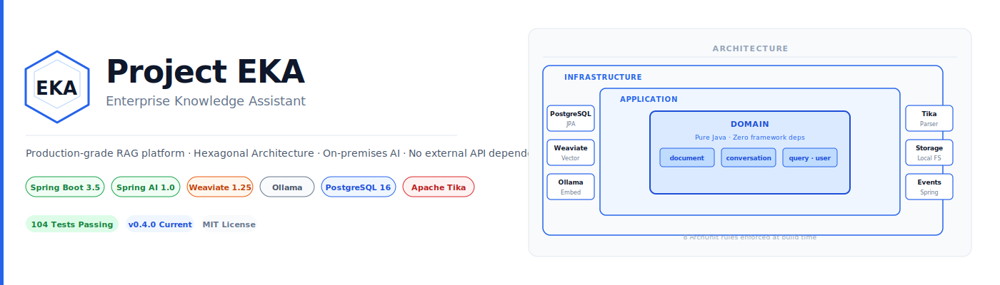
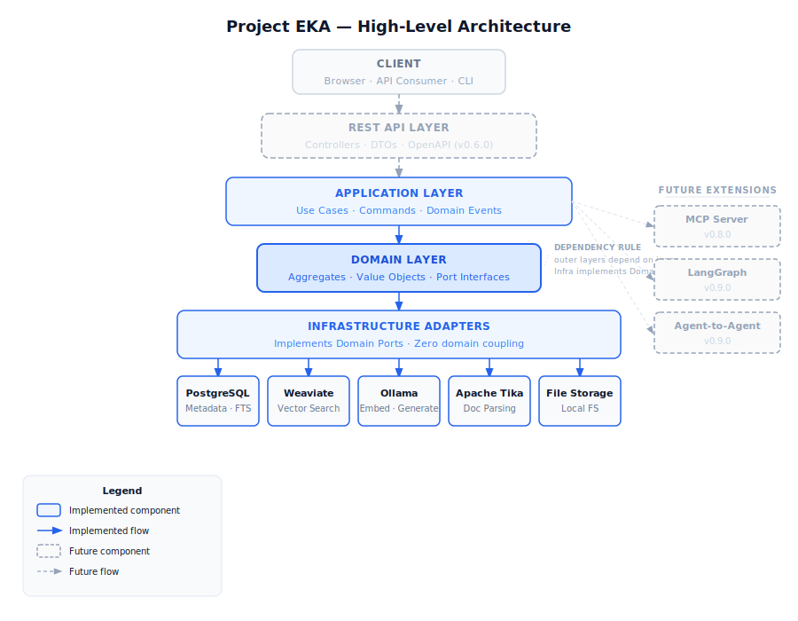
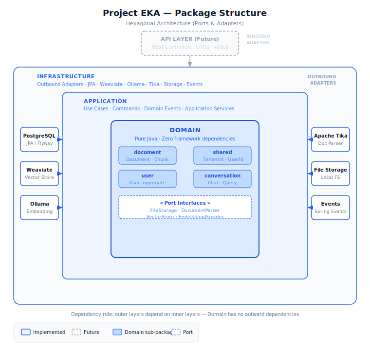
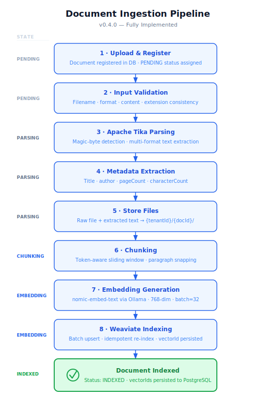
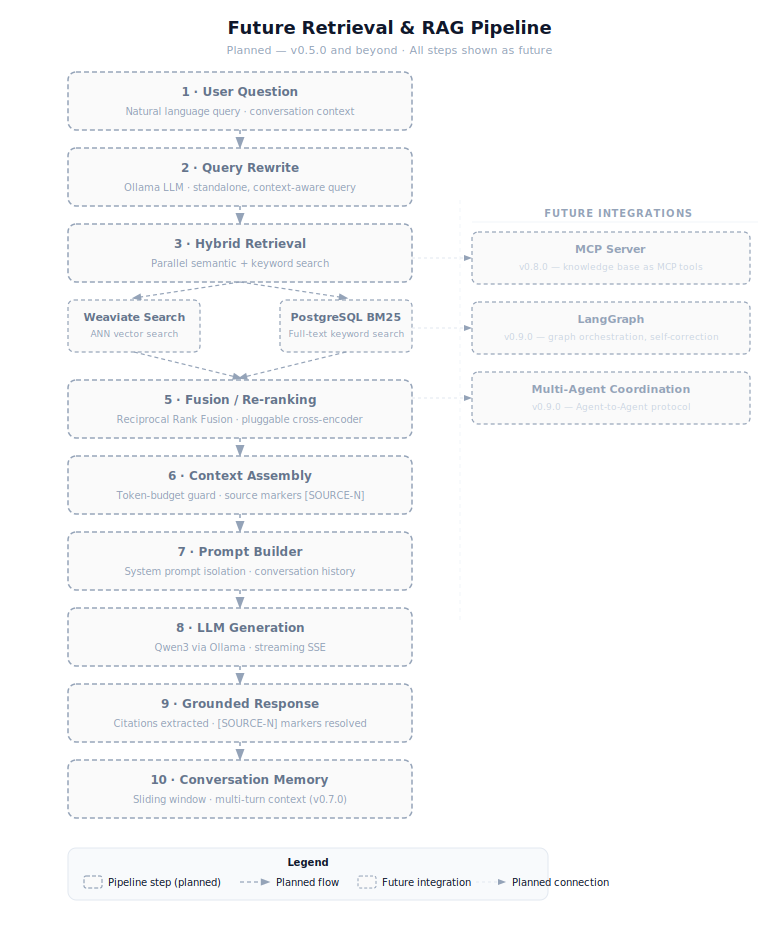
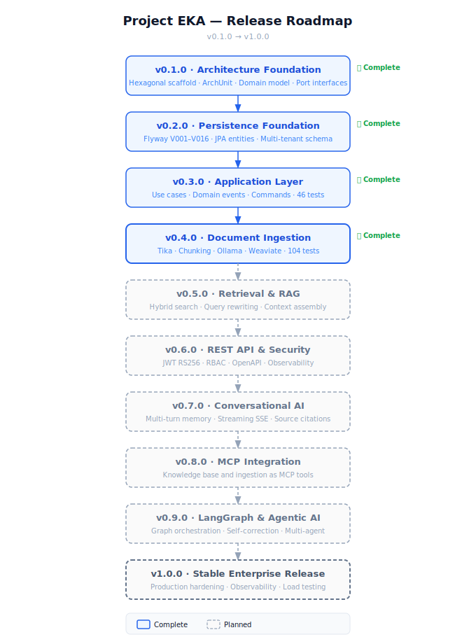

<div align="center">



# Project EKA — Enterprise Knowledge Assistant

*A reference implementation of an enterprise-grade Retrieval-Augmented Generation (RAG) platform — built with Hexagonal Architecture, Spring AI, and fully on-premises AI models — with complete data ownership and no external API dependencies.*

[](https://openjdk.org/projects/jdk/21/)
[](https://spring.io/projects/spring-boot)
[](https://spring.io/projects/spring-ai)
[](https://weaviate.io)
[](https://www.postgresql.org/)
[](https://tika.apache.org/)
[](docs/releases/v0.4.0.md)
[](LICENSE)

</div>

---

## Highlights

- Hexagonal Architecture (Ports & Adapters) — ArchUnit-enforced at build time
- Domain-Driven Design — pure domain model with zero framework dependencies
- Spring AI 1.0.0 — unified abstraction over embedding models and vector stores
- Apache Tika 2.9.2 — multi-format document parsing with magic-byte detection
- Ollama — local embedding (`nomic-embed-text`, 768-dim) and generation (`qwen3`)
- Weaviate 1.25 — vector store with native multi-tenancy support
- PostgreSQL 16 — relational metadata, full-text search, append-only audit log
- Hybrid Search *(v0.5.0)*
- MCP Ready *(v0.8.0)*
- LangGraph Ready *(v0.9.0)*
- 104 Automated Tests, 0 failures

---

## What is Project EKA?

Project EKA (Enterprise Knowledge Assistant) is an open-architecture exploration of how modern AI can transform scattered enterprise documents into a secure, searchable, and conversational knowledge platform — with full data ownership and on-premises deployment.

The platform is built to evolve from basic document retrieval to autonomous multi-agent workflows. Every AI touchpoint (embedding, generation, vector storage, document parsing) sits behind a port interface. Swapping Ollama for AWS Bedrock, or Weaviate for pgvector, requires changing one adapter with zero domain or application changes.

---

## Why Project EKA?

Most RAG implementations are demos. They work for a single user, on a single machine, with hardcoded API keys, and collapse the moment a real requirement is added. Project EKA is built differently.

| Differentiator | What it means in practice |
|---|---|
| **Hexagonal Architecture — enforced** | The build fails if an infrastructure class is imported into the domain layer. Eight ArchUnit rules run on every `gradle test`. Architecture is not a convention — it is a constraint. |
| **Zero external API dependency** | No OpenAI key. No cloud vector store account. Ollama, Weaviate, and PostgreSQL run locally via Docker. Complete data ownership from day one. |
| **Multi-tenancy as a first-class citizen** | Every entity carries `TenantId`. Weaviate uses native per-tenant collections — not property-based filtering. This is in V001 of the schema, not retrofitted. |
| **Provider independence is real** | To swap the embedding provider, implement `EmbeddingProvider` (one file) and update `application.yml`. Zero domain or application layer changes — enforced by the port boundary, not by documentation. |
| **Document lifecycle as a state machine** | `PENDING → PARSING → CHUNKING → EMBEDDING → INDEXED` with valid transitions enforced in the domain aggregate. Not a status field — a state machine. |
| **Built for LangGraph and MCP** | Every application service is stateless. The `KnowledgeQuery` aggregate holds retrieval state. Port interfaces align with what MCP tools and LangGraph nodes expect. Adopting these frameworks requires zero domain rewrites. |

---

## Current Status

| | |
|---|---|
| **Current Release** | v0.4.0 — Document Ingestion |
| **Document Pipeline** | `PENDING → PARSING → CHUNKING → EMBEDDING → INDEXED` ✅ |
| **Automated Tests** | 104 passing, 0 failures · 16 test classes |
| **ArchUnit Rules** | 8 enforced at build time |
| **Schema Migrations** | Flyway V001–V016 (16 migrations) |
| **Current Focus** | v0.5.0 — Retrieval & RAG Pipeline |
| **Next Milestone** | Hybrid search, query rewriting, context assembly |

---

## Current Capabilities

**Implemented — v0.4.0**

- ✅ Multi-format document upload with format-filename consistency validation
- ✅ Apache Tika parsing with magic-byte format detection
- ✅ Token-aware sliding window chunking with paragraph-boundary snapping
- ✅ Batch embedding generation via Ollama (`nomic-embed-text`, 768-dim)
- ✅ Weaviate vector indexing with idempotent re-index support
- ✅ Delete synchronization — Weaviate vectors and chunks removed on document delete
- ✅ Ingestion validation — vector count, duplicate detection, provenance checks
- ✅ Ingestion benchmark — per-phase timing (chunk / embed / index / persist) and throughput

**Coming Next — v0.5.0**

- ⏳ BM25 keyword search (PostgreSQL full-text search)
- ⏳ ANN semantic search (Weaviate)
- ⏳ Hybrid search fusion (alpha-weighted Reciprocal Rank Fusion)
- ⏳ Query rewriting via Ollama
- ⏳ Context assembly with token-budget guard
- ⏳ Re-ranking (no-op by default, pluggable cross-encoder)

**Planned — v0.6.0 and beyond**

- ⏳ REST API with OpenAPI specification
- ⏳ JWT RS256 authentication and role-based access control
- ⏳ Conversational AI with sliding-window memory
- ⏳ Server-Sent Events streaming responses with source citations
- ⏳ MCP server — knowledge base and ingestion exposed as MCP tools (v0.8.0)
- ⏳ LangGraph agentic pipeline with self-correction loop (v0.9.0)

---

## Architecture

Project EKA is built as a **Modular Monolith** with strict **Hexagonal Architecture** (Ports & Adapters):

```
api/          →  application/  →  domain/  ←  infrastructure/
(HTTP, DTOs)     (use cases)      (pure)       (JPA, Weaviate, Ollama, Tika)
```

- **Domain** — pure Java aggregates, value objects, and port interfaces; zero framework dependencies
- **Application** — use cases, commands, domain events; no infrastructure imports
- **Infrastructure** — JPA adapters, Weaviate adapter, Ollama adapter, Tika adapter, file storage
- **API** — REST controllers *(coming in v0.6.0)*
- **ArchUnit** — 8 layering rules enforced at build time; violations fail the build

### High-Level Architecture



### Package Structure



### Document Ingestion Pipeline



### Retrieval & RAG Pipeline *(Planned — v0.5.0)*



For detailed architecture documentation see [docs/architecture/overview.md](docs/architecture/overview.md), [docs/architecture/logical.md](docs/architecture/logical.md), and [docs/architecture/components.md](docs/architecture/components.md).

---

## Technology Stack

### Implemented

| Category | Technology | Version | Role |
|---|---|---|---|
| Runtime | Java | 21 (LTS) | Virtual threads, records, pattern matching (`--enable-preview`) |
| Framework | Spring Boot | 3.5.0 | Application container and auto-configuration |
| AI Orchestration | Spring AI | 1.0.0 | Unified embedding and vector store abstraction |
| Embedding | nomic-embed-text via Ollama | Latest | Local 768-dim dense embeddings |
| Vector Store | Weaviate | 1.25 | ANN search, native multi-tenancy |
| Relational DB | PostgreSQL | 16 | Metadata, audit log, future BM25 full-text search |
| ORM | Hibernate 6 / Spring Data JPA | Bundled | JPA persistence with custom domain mappers |
| Migrations | Flyway | 10+ | Versioned schema migrations (V001–V016) |
| Document Parsing | Apache Tika | 2.9.2 | Multi-format extraction, magic-byte detection |
| Architecture Testing | ArchUnit | 1.3.0 | Hexagonal layering enforcement |
| Build | Gradle | 8.12 | |

### Planned

| Category | Technology | Phase | Role |
|---|---|---|---|
| Generation | Qwen3 via Ollama | v0.5.0 | Local LLM for query rewriting and generation |
| Security | Spring Security + JJWT 0.12+ | v0.6.0 | JWT RS256 authentication, RBAC |
| Observability | Micrometer + Prometheus + Grafana | v0.6.0 | Metrics, tracing, dashboards |
| AI Protocol | Spring MCP Server | v0.8.0 | Expose knowledge base as MCP tools |
| Graph Orchestration | LangGraph4j | v0.9.0 | Agentic retrieval with self-correction |

---

## Quick Start

### Prerequisites

- Java 21+
- Docker and Docker Compose v2
- 8 GB RAM minimum (Weaviate + PostgreSQL + Ollama)
- Gradle Wrapper (included)

### 1. Start infrastructure

```bash
docker compose up -d postgres weaviate ollama
```

### 2. Pull the embedding model (first run only)

```bash
docker exec -it ollama ollama pull nomic-embed-text
```

### 3. Run the application

```bash
./gradlew bootRun
```

Flyway migrations run automatically on startup.

### 4. Verify

```
GET http://localhost:8080/actuator/health
```

### Configuration

Override via environment variables or `application.yml`:

| Variable | Default |
|---|---|
| `DB_URL` | `jdbc:postgresql://localhost:5432/project_eka` |
| `DB_USERNAME` | `ka_user` |
| `DB_PASSWORD` | — required |
| `OLLAMA_URL` | `http://localhost:11434` |
| `OLLAMA_EMBEDDING_MODEL` | `nomic-embed-text` |
| `OLLAMA_CHAT_MODEL` | `qwen3` |
| `WEAVIATE_SCHEME` | `http` |
| `WEAVIATE_HOST` | `localhost:8080` |
| `WEAVIATE_API_KEY` | — optional |
| `DOCUMENT_STORAGE_ROOT` | `/data/documents` |

---

## Documentation

| Document | Description |
|---|---|
| [Architecture Overview](docs/architecture/overview.md) | High-level system design, technology decisions, and guiding principles |
| [Logical Architecture](docs/architecture/logical.md) | Layer responsibilities, dependency rules, and data flow |
| [Component Architecture](docs/architecture/components.md) | Service responsibilities, RAG pipeline design, and sequence flows |
| [Executive Summary](docs/architecture/executive-summary.md) | Non-technical overview for architects and engineering managers |
| [Roadmap](docs/roadmap.md) | Detailed phase design, MCP integration, LangGraph, and multi-agent plans |
| [Release Notes v0.4.0](docs/releases/v0.4.0.md) | Document ingestion pipeline — full changelog |
| [Release Notes v0.3.0](docs/releases/v0.3.0.md) | Application layer — full changelog |

---

## Release Roadmap



See [docs/roadmap.md](docs/roadmap.md) for full phase design and success criteria.

| Version | Scope | Status |
|---|---|---|
| v0.1.0 | Architecture Foundation — hexagonal scaffold, ArchUnit, domain model | ✅ Complete |
| v0.2.0 | Persistence Foundation — Flyway schema, JPA entities, repository adapters | ✅ Complete |
| v0.3.0 | Application Layer — use cases, domain events, commands, 46 tests | ✅ Complete |
| v0.4.0 | Document Ingestion — Tika parsing, chunking, embedding, Weaviate indexing | ✅ Complete |
| v0.5.0 | Retrieval & RAG — hybrid search, query rewriting, context assembly, re-ranking | ⏳ Planned |
| v0.6.0 | REST API & Security — JWT RS256, RBAC, controllers, OpenAPI, observability | ⏳ Planned |
| v0.7.0 | Conversational AI — memory, multi-turn, streaming responses, citations | ⏳ Planned |
| v0.8.0 | MCP Integration — knowledge base and ingestion exposed as MCP tools | ⏳ Planned |
| v0.9.0 | LangGraph & Agentic AI — graph orchestration, self-correction, multi-agent | ⏳ Planned |
| v1.0.0 | First Stable Release — production hardening, observability, load testing | ⏳ Planned |

---

## Contributing

1. Fork the repository
2. Create a feature branch: `git checkout -b feature/your-feature`
3. Ensure all tests and ArchUnit rules pass: `gradle test`
4. Submit a pull request with a clear description of changes

**Architecture constraints:** The hexagonal layer structure (`domain`, `application`, `infrastructure`, `api`), domain aggregate boundaries, port interface contracts, and all 8 ArchUnit rules are frozen. Review [docs/architecture/overview.md](docs/architecture/overview.md) before making structural changes.

For questions or feedback, open an issue.

---

## License

[MIT License](LICENSE)
