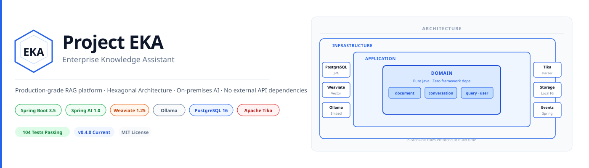
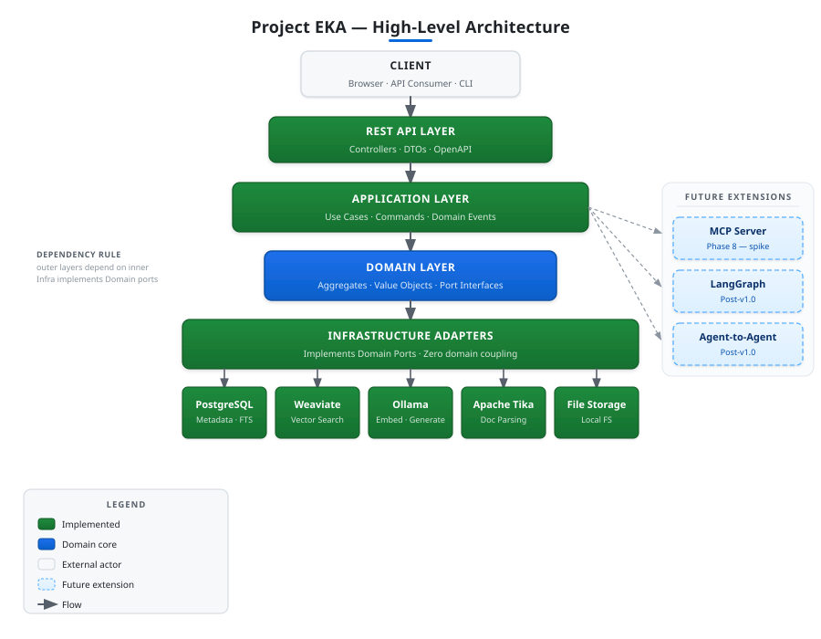
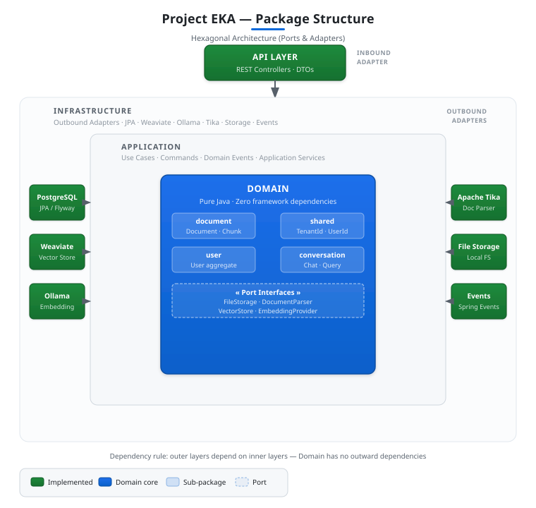
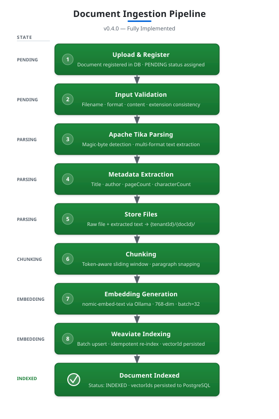
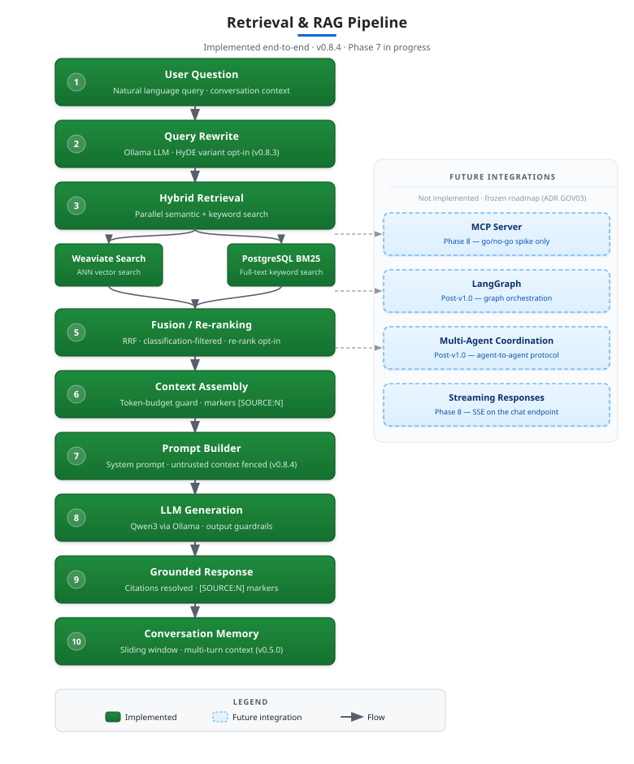
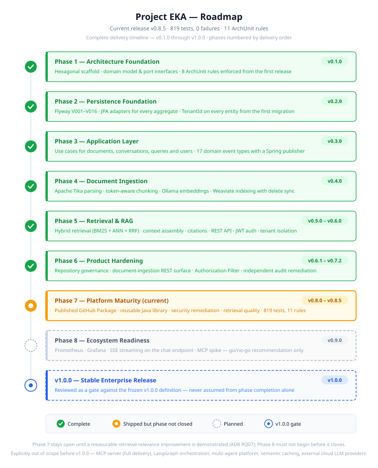

<div align="center">



# Project EKA — Enterprise Knowledge Assistant

*A reference implementation of an enterprise-grade Retrieval-Augmented Generation (RAG) platform — built with Hexagonal Architecture, Spring AI, and fully on-premises AI models — with complete data ownership and no external API dependencies.*

[](https://openjdk.org/projects/jdk/21/)
[](https://spring.io/projects/spring-boot)
[](https://spring.io/projects/spring-ai)
[](https://weaviate.io)
[](https://www.postgresql.org/)
[](https://tika.apache.org/)
[](docs/releases/v0.4.0.md)
[](LICENSE)

</div>

---

## Highlights

- Hexagonal Architecture (Ports & Adapters) — ArchUnit-enforced at build time
- Domain-Driven Design — pure domain model with zero framework dependencies
- Spring AI 1.0.0 — unified abstraction over embedding models and vector stores
- Apache Tika 2.9.2 — multi-format document parsing with magic-byte detection
- Ollama — local embedding (`nomic-embed-text`, 768-dim) and generation (`qwen3`)
- Weaviate 1.25 — vector store with native multi-tenancy support
- PostgreSQL 16 — relational metadata, full-text search, append-only audit log
- Hybrid Search *(v0.5.0)*
- MCP Ready *(v0.8.0)*
- LangGraph Ready *(v0.9.0)*
- 606 Automated Tests, 0 failures

---

## What is Project EKA?

Project EKA (Enterprise Knowledge Assistant) is an open-architecture exploration of how modern AI can transform scattered enterprise documents into a secure, searchable, and conversational knowledge platform — with full data ownership and on-premises deployment.

The platform is built to evolve from basic document retrieval to autonomous multi-agent workflows. Every AI touchpoint (embedding, generation, vector storage, document parsing) sits behind a port interface. Swapping Ollama for AWS Bedrock, or Weaviate for pgvector, requires changing one adapter with zero domain or application changes.

---

## Why Project EKA?

Most RAG implementations are demos. They work for a single user, on a single machine, with hardcoded API keys, and collapse the moment a real requirement is added. Project EKA is built differently.

| Differentiator | What it means in practice |
|---|---|
| **Hexagonal Architecture — enforced** | The build fails if an infrastructure class is imported into the domain layer. Eight ArchUnit rules run on every `gradle test`. Architecture is not a convention — it is a constraint. |
| **Zero external API dependency** | No OpenAI key. No cloud vector store account. Ollama, Weaviate, and PostgreSQL run locally via Docker. Complete data ownership from day one. |
| **Multi-tenancy as a first-class citizen** | Every entity carries `TenantId`. Weaviate uses native per-tenant collections — not property-based filtering. This is in V001 of the schema, not retrofitted. |
| **Provider independence is real** | To swap the embedding provider, implement `EmbeddingProvider` (one file) and update `application.yml`. Zero domain or application layer changes — enforced by the port boundary, not by documentation. |
| **Document lifecycle as a state machine** | `PENDING → PARSING → CHUNKING → EMBEDDING → INDEXED` with valid transitions enforced in the domain aggregate. Not a status field — a state machine. |
| **Built for LangGraph and MCP** | Every application service is stateless. The `KnowledgeQuery` aggregate holds retrieval state. Port interfaces align with what MCP tools and LangGraph nodes expect. Adopting these frameworks requires zero domain rewrites. |

---

## Current Status

| | |
|---|---|
| **Current Release** | v0.6.0 — Application Platform (Phase 5, complete) |
| **Document Pipeline** | `PENDING → PARSING → CHUNKING → EMBEDDING → INDEXED` ✅ |
| **Automated Tests** | 606 passing, 0 failures · 59 test classes |
| **ArchUnit Rules** | 8 enforced at build time |
| **Schema Migrations** | Flyway V001–V017 (17 migrations) |
| **Current Focus** | P05.5 — Operational Hardening & Phase 5 Completion (complete) |
| **Next Milestone** | Phase 6 — not yet scoped |

---

## Current Capabilities

**Implemented — v0.4.0 (ingestion foundation)**

- ✅ Multi-format document upload with format-filename consistency validation
- ✅ Apache Tika parsing with magic-byte format detection
- ✅ Token-aware sliding window chunking with paragraph-boundary snapping
- ✅ Batch embedding generation via Ollama (`nomic-embed-text`, 768-dim)
- ✅ Weaviate vector indexing with idempotent re-index support
- ✅ Delete synchronization — Weaviate vectors and chunks removed on document delete
- ✅ Ingestion validation — vector count, duplicate detection, provenance checks
- ✅ Ingestion benchmark — per-phase timing (chunk / embed / index / persist) and throughput

**Implemented — v0.5.0 (retrieval & generation)**

- ✅ BM25 keyword search (PostgreSQL full-text search) + ANN semantic search (Weaviate)
- ✅ Hybrid search fusion (alpha-weighted Reciprocal Rank Fusion)
- ✅ Query rewriting via Ollama
- ✅ Context assembly with token-budget guard
- ✅ Chat generation with output guardrails, citation engine, and persisted conversational memory

**Implemented — v0.5.1–v0.6.0 (application platform, Phase 5 complete)**

- ✅ REST API with OpenAPI/Swagger specification (`/api/v1/conversations`)
- ✅ End-to-end RAG orchestration — one HTTP request drives retrieval → context assembly → generation → citation → persistence
- ✅ JWT authentication (HS256) — `POST /api/v1/auth/login` issues an access token; every other endpoint requires one
- ✅ Role authorization — creating a conversation or sending a message requires `USER` or `ADMIN`; `VIEWER`/`AUDITOR` are read-only
- ✅ Tenant isolation and resource ownership — a conversation is reachable only by the user who created it, within its own tenant; every other case (including a different user in the *same* tenant) returns `404`, not `403`; tenant checks now cover every ownership-scoped `ConversationApplicationService` method, including the not-yet-routed `rename`/`delete` (v0.6.0)
- ✅ Observability — `/actuator/health`+`/actuator/info` (public), `/actuator/metrics`+`/actuator/prometheus` (JWT-gated by default, or isolated onto a separate `MANAGEMENT_PORT` — v0.6.0); custom Ollama/Weaviate health checks; retrieval/generation/orchestration latency via Micrometer `Observation`; auth/authz failure counters; correlation IDs on every request; structured (ECS JSON) console logging
- ✅ Operational hardening (v0.6.0) — short, per-step transactions through the upload pipeline instead of one long transaction; failed ingestion now marks the document `FAILED` with an error message instead of leaving it stuck mid-pipeline; bounded Ollama HTTP connect/read timeouts; infrastructure failures from retrieval consistently surface as `502`, oversized/blank queries as `400`; no default database password outside `dev`/`test`

**Planned — Phase 6 and beyond**

- ⏳ Server-Sent Events streaming responses with source citations
- ⏳ MCP server — knowledge base and ingestion exposed as MCP tools
- ⏳ LangGraph agentic pipeline with self-correction loop
- ⏳ Configurable Weaviate client timeout — no configuration surface exists in Spring AI 1.0.0 today (see `.claude/DECISIONS.md`, ADR HD03)

---

## Architecture

Project EKA is built as a **Modular Monolith** with strict **Hexagonal Architecture** (Ports & Adapters):

```
api/          →  application/  →  domain/  ←  infrastructure/
(HTTP, DTOs)     (use cases)      (pure)       (JPA, Weaviate, Ollama, Tika)
```

- **Domain** — pure Java aggregates, value objects, and port interfaces; zero framework dependencies
- **Application** — use cases, commands, domain events; no infrastructure imports
- **Infrastructure** — JPA adapters, Weaviate adapter, Ollama adapter, Tika adapter, file storage
- **API** — REST controllers, JWT authentication, tenant/role authorization, observability (`v0.5.1`–`v0.5.4`)
- **ArchUnit** — 8 layering rules enforced at build time; violations fail the build

### High-Level Architecture



### Package Structure



### Document Ingestion Pipeline



### Retrieval & RAG Pipeline



For detailed architecture documentation see [docs/architecture/overview.md](docs/architecture/overview.md), [docs/architecture/logical.md](docs/architecture/logical.md), and [docs/architecture/components.md](docs/architecture/components.md).

---

## Technology Stack

### Implemented

| Category | Technology | Version | Role |
|---|---|---|---|
| Runtime | Java | 21 (LTS) | Virtual threads, records, pattern matching (`--enable-preview`) |
| Framework | Spring Boot | 3.5.0 | Application container and auto-configuration |
| AI Orchestration | Spring AI | 1.0.0 | Unified embedding and vector store abstraction |
| Embedding | nomic-embed-text via Ollama | Latest | Local 768-dim dense embeddings |
| Vector Store | Weaviate | 1.25 | ANN search, native multi-tenancy |
| Relational DB | PostgreSQL | 16 | Metadata, audit log, BM25 full-text search |
| ORM | Hibernate 6 / Spring Data JPA | Bundled | JPA persistence with custom domain mappers |
| Migrations | Flyway | 10+ | Versioned schema migrations (V001–V017) |
| Document Parsing | Apache Tika | 2.9.2 | Multi-format extraction, magic-byte detection |
| Generation | Qwen3 via Ollama | Latest | Local LLM for query rewriting and chat generation |
| Security | Spring Security + JJWT 0.12+ | — | JWT (HS256) authentication (v0.5.2); role + tenant/ownership authorization (v0.5.3, extended to every ownership-scoped method in v0.6.0) |
| Observability | Spring Boot Actuator + Micrometer + Micrometer Observation | — | Health, metrics, request/latency instrumentation, correlation IDs, structured logging (v0.5.4); optional separate management port (v0.6.0); no Prometheus/Grafana deployment yet — see Planned |
| Architecture Testing | ArchUnit | 1.3.0 | Hexagonal layering enforcement |
| Build | Gradle | 8.12 | |

### Planned

| Category | Technology | Phase | Role |
|---|---|---|---|
| Observability Deployment | Prometheus + Grafana | Future | Scrape `/actuator/prometheus`, dashboards (metrics themselves already exist as of v0.5.4; separate management port available as of v0.6.0) |
| Weaviate client timeout | Custom `WeaviateClient` bean override | Future | No configuration surface exists in Spring AI 1.0.0 today — deferred, see `.claude/DECISIONS.md` ADR HD03 |
| AI Protocol | Spring MCP Server | v0.8.0 | Expose knowledge base as MCP tools |
| Graph Orchestration | LangGraph4j | v0.9.0 | Agentic retrieval with self-correction |

---

## Quick Start

### Prerequisites

- Java 21+
- Docker and Docker Compose v2
- 8 GB RAM minimum (Weaviate + PostgreSQL + Ollama)
- Gradle Wrapper (included)

### 1. Start infrastructure

```bash
docker compose up -d postgres weaviate ollama
```

### 2. Pull the embedding model (first run only)

```bash
docker exec -it ollama ollama pull nomic-embed-text
```

### 3. Run the application

```bash
./gradlew bootRun
```

Flyway migrations run automatically on startup.

### 4. Verify

```
GET http://localhost:8080/actuator/health
GET http://localhost:8080/actuator/info
```

Both are public (v0.5.4). `/actuator/metrics` and `/actuator/prometheus` require a JWT like every
other non-public endpoint — see [Observability](#observability) below. Every response, success or
error, carries an `X-Correlation-Id` header.

### 5. Authenticate

Every endpoint under `/api/v1/conversations` now requires a JWT (v0.5.2). There is no
self-service registration endpoint yet — seed at least one user directly (e.g. via a migration
or a one-off script, with a BCrypt-hashed password and at least one of the four `UserRole`
values) before logging in:

```
POST /api/v1/auth/login
{"tenantId": "<uuid>", "email": "user@example.com", "password": "..."}

→ {"accessToken": "...", "tokenType": "Bearer", "expiresInMs": 900000}
```

Send the returned token as `Authorization: Bearer <accessToken>` on every subsequent request.
As of v0.5.3, the seeded user's role also matters: creating a conversation or sending a message
requires `USER` or `ADMIN` — a `VIEWER`/`AUDITOR` token gets `403` on those two endpoints (reading
a conversation is open to all four roles, subject to ownership).

### Configuration

Override via environment variables or `application.yml`:

| Variable | Default |
|---|---|
| `DB_URL` | `jdbc:postgresql://localhost:5432/project_eka` |
| `DB_USERNAME` | `ka_user` |
| `DB_PASSWORD` | — required |
| `JWT_SECRET_KEY` | — required (no default outside `dev`/`test` profiles) |
| `JWT_ACCESS_EXPIRY_MS` | `900000` (15 min) |
| `OLLAMA_URL` | `http://localhost:11434` |
| `OLLAMA_EMBEDDING_MODEL` | `nomic-embed-text` |
| `OLLAMA_CHAT_MODEL` | `qwen3` |
| `WEAVIATE_SCHEME` | `http` |
| `WEAVIATE_HOST` | `localhost:8080` |
| `WEAVIATE_API_KEY` | — optional |
| `DOCUMENT_STORAGE_ROOT` | `/data/documents` |
| `SERVER_PORT` | `8080` |
| `MANAGEMENT_PORT` | same as `SERVER_PORT` — set to a different value to isolate actuator endpoints onto a separate port, outside the JWT-based `SecurityFilterChain` (v0.6.0) |
| `app.ollama.connect-timeout-ms` / `app.ollama.read-timeout-ms` | `5000` / `60000` — Ollama HTTP connect/read timeouts (v0.6.0; standard Spring relaxed binding, e.g. `APP_OLLAMA_CONNECT_TIMEOUT_MS`) |

### Observability

- `GET /actuator/health` (public) — aggregates DB connectivity plus custom `ollama`/`weaviate`
  checks; `/actuator/health/liveness` and `/actuator/health/readiness` are also available
- `GET /actuator/info` (public) — static app name/version
- `GET /actuator/metrics`, `GET /actuator/prometheus` (require a JWT, like every other non-public
  endpoint, unless `MANAGEMENT_PORT` is set to isolate actuator onto its own port — v0.6.0) —
  retrieval/generation/orchestration latency, `http.server.requests`, and
  `eka.auth.failures` / `eka.authz.failures` counters
- Every response carries an `X-Correlation-Id` header (generated, or echoed back if you send one)
- Console logs are structured JSON (Elastic Common Schema) in every profile, with the correlation
  ID automatically included on every line for a request

---

## Documentation

| Document | Description |
|---|---|
| [Architecture Overview](docs/architecture/overview.md) | High-level system design, technology decisions, and guiding principles |
| [Logical Architecture](docs/architecture/logical.md) | Layer responsibilities, dependency rules, and data flow |
| [Component Architecture](docs/architecture/components.md) | Service responsibilities, RAG pipeline design, and sequence flows |
| [Executive Summary](docs/architecture/executive-summary.md) | Non-technical overview for architects and engineering managers |
| [Roadmap](docs/roadmap.md) | Detailed phase design, MCP integration, LangGraph, and multi-agent plans |
| [Release Notes v0.4.0](docs/releases/v0.4.0.md) | Document ingestion pipeline — full changelog |
| [Release Notes v0.3.0](docs/releases/v0.3.0.md) | Application layer — full changelog |

---

## Release Roadmap



See [docs/roadmap.md](docs/roadmap.md) for full phase design and success criteria. This table
predates Phase 5's finer-grained milestone tracking (P05.1–P05.5); see
[.claude/ROADMAP.md](.claude/ROADMAP.md) and [.claude/PROJECT_STATE.md](.claude/PROJECT_STATE.md)
for the authoritative, currently-maintained status of everything from v0.5.1 onward.

| Version | Scope | Status |
|---|---|---|
| v0.1.0 | Architecture Foundation — hexagonal scaffold, ArchUnit, domain model | ✅ Complete |
| v0.2.0 | Persistence Foundation — Flyway schema, JPA entities, repository adapters | ✅ Complete |
| v0.3.0 | Application Layer — use cases, domain events, commands, 46 tests | ✅ Complete |
| v0.4.0 | Document Ingestion — Tika parsing, chunking, embedding, Weaviate indexing | ✅ Complete |
| v0.5.0 | Retrieval & RAG — hybrid search, query rewriting, context assembly, chat generation | ✅ Complete |
| v0.5.1 | REST API — end-to-end RAG orchestration, OpenAPI (P05.1) | ✅ Complete |
| v0.5.2 | JWT Authentication Foundation (P05.2) | ✅ Complete |
| v0.5.3 | Tenant & Role Authorization Boundary (P05.3) | ✅ Complete |
| v0.5.4 | Observability Foundation (P05.4) | ✅ Complete |
| v0.6.0 | Operational Hardening & Phase 5 Completion (P05.5) | ✅ Complete |
| v0.7.0 | Conversational AI streaming responses | ⏳ Planned |
| v0.8.0 | MCP Integration — knowledge base and ingestion exposed as MCP tools | ⏳ Planned |
| v0.9.0 | LangGraph & Agentic AI — graph orchestration, self-correction, multi-agent | ⏳ Planned |
| v1.0.0 | First Stable Release — production hardening, observability, load testing | ⏳ Planned |

---

## Contributing

1. Fork the repository
2. Create a feature branch: `git checkout -b feature/your-feature`
3. Ensure all tests and ArchUnit rules pass: `gradle test`
4. Submit a pull request with a clear description of changes

**Architecture constraints:** The hexagonal layer structure (`domain`, `application`, `infrastructure`, `api`), domain aggregate boundaries, port interface contracts, and all 8 ArchUnit rules are frozen. Review [docs/architecture/overview.md](docs/architecture/overview.md) before making structural changes.

For questions or feedback, open an issue.

---

## License

[MIT License](LICENSE)
