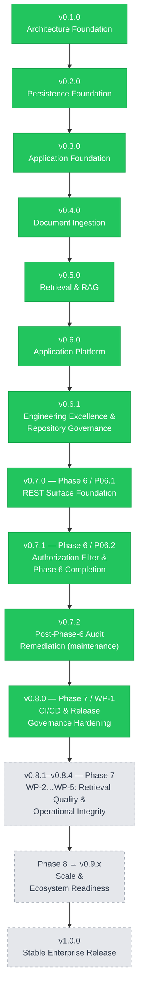

<div align="center">


# Project EKA — Enterprise Knowledge Assistant

*A reference implementation of an enterprise-grade Retrieval-Augmented Generation (RAG) platform — built with Hexagonal Architecture, Spring AI, and fully on-premises AI models — with complete data ownership and no external API dependencies.*

[](https://openjdk.org/projects/jdk/21/)
[](https://spring.io/projects/spring-boot)
[](https://spring.io/projects/spring-ai)
[](https://weaviate.io)
[](https://www.postgresql.org/)
[](https://tika.apache.org/)
[](docs/releases/v0.4.0.md)
[](LICENSE)

</div>

---

## Highlights

- Hexagonal Architecture (Ports & Adapters) — ArchUnit-enforced at build time
- Domain-Driven Design — pure domain model with zero framework dependencies
- Spring AI 1.0.0 — unified abstraction over embedding models and vector stores
- Apache Tika 2.9.2 — multi-format document parsing with magic-byte detection
- Ollama — local embedding (`nomic-embed-text`, 768-dim) and generation (`qwen3`)
- Weaviate 1.25 — vector store, tenant-isolated via a mandatory query-time filter
- PostgreSQL 16 — relational metadata, full-text search
- Hybrid Search *(v0.5.0)*
- Authorization Filter *(v0.7.1)* — role-based document-classification clearance
- MCP & LangGraph Ready — architecturally (port interfaces align with both), not yet on the release roadmap; see [Roadmap](#release-roadmap)
- 802 Automated Tests, 0 failures

---

## What is Project EKA?

Project EKA (Enterprise Knowledge Assistant) is an open-architecture exploration of how modern AI can transform scattered enterprise documents into a secure, searchable, and conversational knowledge platform — with full data ownership and on-premises deployment.

The platform is built to evolve from basic document retrieval to autonomous multi-agent workflows. Every AI touchpoint (embedding, generation, vector storage, document parsing) sits behind a port interface. Swapping Ollama for AWS Bedrock, or Weaviate for pgvector, requires changing one adapter with zero domain or application changes.

---

## Why Project EKA?

Most RAG implementations are demos. They work for a single user, on a single machine, with hardcoded API keys, and collapse the moment a real requirement is added. Project EKA is built differently.

| Differentiator | What it means in practice |
|---|---|
| **Hexagonal Architecture — enforced** | The build fails if an infrastructure class is imported into the domain layer. Eight ArchUnit rules run on every `gradle test`. Architecture is not a convention — it is a constraint. |
| **Zero external API dependency** | No OpenAI key. No cloud vector store account. Ollama, Weaviate, and PostgreSQL run locally via Docker. Complete data ownership from day one. |
| **Multi-tenancy as a first-class citizen** | Every entity carries `TenantId`, in V001 of the schema, not retrofitted. Weaviate isolation is a mandatory `tenantId` query-time filter applied server-side on every call (property-based, not Weaviate's native per-collection multi-tenancy). |
| **Provider independence is real** | To swap the embedding provider, implement `EmbeddingProvider` (one file) and update `application.yml`. Zero domain or application layer changes — enforced by the port boundary, not by documentation. |
| **Document lifecycle as a state machine** | `PENDING → PARSING → CHUNKING → EMBEDDING → INDEXED` with valid transitions enforced in the domain aggregate. Not a status field — a state machine. |
| **Built for LangGraph and MCP** | Every application service is stateless. The `KnowledgeQuery` aggregate holds retrieval state. Port interfaces align with what MCP tools and LangGraph nodes expect. Adopting these frameworks requires zero domain rewrites. |

---

## Current Status

| | |
|---|---|
| **Current Release** | v0.8.3 — Phase 7 / WP-4: Retrieval Quality (re-ranking, HyDE, evaluation harness) |
| **Document Pipeline** | `PENDING → PARSING → CHUNKING → EMBEDDING → INDEXED` ✅ |
| **Automated Tests** | 802 passing, 0 failures · 82 test classes |
| **ArchUnit Rules** | 8 enforced at build time |
| **CI** | GitHub Actions — build + full test suite + ArchUnit, dependency-review SCA gate, and a verified `docker build`, on every PR and push to `main` |
| **Schema Migrations** | Flyway V001–V019 (19 migrations) |
| **Current Focus** | Phase 7 (Retrieval Quality & Operational Integrity) — planned and in progress across five work packages (v0.8.0–v0.8.4) |
| **Next Milestone** | Phase 7 / WP-5 — Prompt-Injection Review + Phase 7 completion gate (v0.8.4) |

---

## Current Capabilities

**Implemented — v0.4.0 (ingestion foundation)**

- ✅ Multi-format document upload with format-filename consistency validation — implemented at the application layer (`UploadDocumentUseCase`) and fully tested; **REST-exposed as of P06.1** via `POST /api/v1/documents` (multipart, closes v0.6.1 ADR EX09's deferral and post-Phase-5 audit finding H2). See "Application Platform" below.
- ✅ Apache Tika parsing with magic-byte format detection
- ✅ Token-aware sliding window chunking with paragraph-boundary snapping
- ✅ Batch embedding generation via Ollama (`nomic-embed-text`, 768-dim)
- ✅ Weaviate vector indexing with idempotent re-index support
- ✅ Delete synchronization — Weaviate vectors and chunks removed on document delete
- ✅ Ingestion validation — vector count, duplicate detection, provenance checks
- ✅ Ingestion benchmark — per-phase timing (chunk / embed / index / persist) and throughput

**Implemented — v0.5.0 (retrieval & generation)**

- ✅ BM25 keyword search (PostgreSQL full-text search) + ANN semantic search (Weaviate)
- ✅ Hybrid search fusion (Reciprocal Rank Fusion, rank-position based, `k=60` — unweighted; no alpha/tunable weighting parameter exists today)
- ✅ Query rewriting via Ollama
- ✅ Context assembly with token-budget guard
- ✅ Chat generation with output guardrails, citation engine, and persisted conversational memory

**Implemented — v0.5.1–v0.6.0 (application platform, Phase 5 complete)**

- ✅ REST API with OpenAPI/Swagger specification (`/api/v1/conversations`)
- ✅ End-to-end RAG orchestration — one HTTP request drives retrieval → context assembly → generation → citation → persistence
- ✅ JWT authentication (HS256) — `POST /api/v1/auth/login` issues an access token; every other endpoint requires one
- ✅ Role authorization — creating a conversation or sending a message requires `USER` or `ADMIN`; `VIEWER`/`AUDITOR` are read-only
- ✅ Tenant isolation and resource ownership — a conversation is reachable only by the user who created it, within its own tenant; every other case (including a different user in the *same* tenant) returns `404`, not `403`; tenant checks now cover every ownership-scoped `ConversationApplicationService` method, including the not-yet-routed `rename`/`delete` (v0.6.0)
- ✅ Observability — `/actuator/health`+`/actuator/info` (public), `/actuator/metrics`+`/actuator/prometheus` (JWT-gated by default, or isolated onto a separate `MANAGEMENT_PORT` — v0.6.0); custom Ollama/Weaviate health checks; retrieval/generation/orchestration latency via Micrometer `Observation`; auth/authz failure counters; correlation IDs on every request; structured (ECS JSON) console logging
- ✅ Operational hardening (v0.6.0) — short, per-step transactions through the upload pipeline instead of one long transaction; failed ingestion now marks the document `FAILED` with an error message instead of leaving it stuck mid-pipeline; bounded Ollama HTTP connect/read timeouts; infrastructure failures from retrieval consistently surface as `502`, oversized/blank queries as `400`; no default database password outside `dev`/`test`

**Implemented — v0.6.1 (engineering excellence & repository governance, post-Phase-5)**

- ✅ CI/CD — GitHub Actions builds, tests, and runs ArchUnit on every pull request and push to `main`; branch protection specified in [docs/governance/branch-protection.md](docs/governance/branch-protection.md)
- ✅ Correct HTTP status codes for client mistakes — malformed JSON, a non-UUID path variable, and similar framework-level errors now return `400`, not a misleading `500`
- ✅ JWT configuration fails fast at startup — a too-short HS256 secret or non-positive token expiry stops the application at boot, not on the first login request
- ✅ Login rate limiting — `POST /api/v1/auth/login` is capped per source IP (10 attempts/minute by default)
- ✅ Request size limits — oversized request bodies are rejected before they reach application code
- ✅ Application `Dockerfile` (multi-stage, non-root) — closes the gap where only the *dependencies* (Postgres/Weaviate/Ollama) were containerized
- ✅ Single source of truth for the release version (`build.gradle` → `/actuator/info`'s `build.version`, no more hand-maintained duplicate)

**Implemented — v0.7.0 / P06.1 (Product Completeness & Authorization Depth — REST Surface Foundation, Phase 6 milestone 1)**

- ✅ Document ingestion REST API — `POST /api/v1/documents` (multipart upload), `GET /{id}`, `GET` (paginated list), `DELETE /{id}`; documents are tenant-wide readable (shared knowledge base), not owner-scoped like conversations
- ✅ First-user bootstrap and minimal admin surface — public `POST /api/v1/admin/bootstrap` (once per tenant), `ADMIN`-only `POST /api/v1/admin/users`, `GET /api/v1/admin/users/{id}`, `POST /api/v1/admin/users/{id}/deactivate`
- ✅ Conversation list and delete — `GET /api/v1/conversations` (own conversations, paginated), `DELETE /api/v1/conversations/{id}`
- ✅ Closed a real cross-tenant read gap in user administration — `getUser`/`activateUser`/`deactivateUser` now verify tenant ownership, not just a valid ID
- ✅ Application-layer validation errors (e.g. `DeleteConversationUseCase`'s active-session guard) now return `400`, not a misleading `500`
- ✅ Request-size protection narrowed to support real uploads without weakening the general limit — only the upload route is exempt, matched on method + path + content type together

**Implemented — v0.7.1 / P06.2 (Authorization Filter, Phase 6 milestone 2)**

- ✅ Role-based document-classification clearance — `PUBLIC` < `INTERNAL` < `CONFIDENTIAL` < `RESTRICTED`; `VIEWER`→`INTERNAL`, `AUDITOR`/`USER`→`CONFIDENTIAL`, `ADMIN`→`RESTRICTED`; a caller's clearance is the maximum across every role they hold
- ✅ Enforced in the retrieval pipeline — a chunk from a document above the caller's clearance is silently excluded before ranking, indistinguishable from "didn't match the query," never a distinct error
- ✅ Enforced consistently across every document REST endpoint — `GET /{id}`, `GET` (list, filtered inside the query itself so pagination stays correct), `DELETE /{id}` — a document above clearance resolves to `404`, never `403` (same anti-enumeration precedent as tenant/ownership checks)
- ✅ Classification now required at ingestion — `POST /api/v1/documents` rejects a missing or unrecognized `classification` value with `400`
- ✅ Fail-closed by design — an unknown, unparseable, or null classification is never granted to any role, including `ADMIN`; a one-time migration classified every pre-existing document `INTERNAL`, with a startup check logging a warning if any document is still unclassified
- ✅ Closes the item this project's target architecture has named since before Phase 4 ("Authorization Filter (planned)... do not assume it already exists")

**Implemented — v0.8.0 / Phase 7 WP-1 (CI/CD & Release Governance Hardening)**

- ✅ Dependency/vulnerability scanning in CI — a `dependency-review` gate fails any pull request introducing a dependency with a known high-or-worse advisory; a `dependency-submission` job keeps GitHub's dependency graph accurate for this Gradle project; Dependabot opens weekly grouped upgrade pull requests
- ✅ Docker image build-verified in CI — a real `docker build` runs on every pull request and push, asserting the boot jar is present and the runtime user is non-root; closes the gap ADR EX10 disclosed (the `Dockerfile` had never once been empirically built, only read)

**Implemented — v0.8.1 / Phase 7 WP-2 (Session Security)**

- ✅ Refresh tokens with rotation — `POST /api/v1/auth/refresh` returns a new access/refresh pair and makes the presented refresh secret single-use; `POST /api/v1/auth/logout` revokes the caller's session
- ✅ **A leaked access token is killable before it expires** — an access token is bound to a persisted session (`sid` claim) that is re-checked on every request, so logging out (or detecting a stolen refresh token) invalidates already-issued access tokens immediately instead of leaving them valid until expiry
- ✅ Refresh-token reuse detection — replaying an already-rotated secret revokes every session that user holds
- ✅ Refresh secrets are stored only as a SHA-256 hash; the raw value is returned exactly once and is never recoverable

**Implemented — v0.8.2 / Phase 7 WP-3 (Operational Resilience)**

- ✅ Bounded Weaviate client timeouts — a hung Weaviate call can no longer hang a retrieval request indefinitely; closes the gap documented as deferred since v0.6.0 (ADR HD03 → OR01)
- ✅ Postgres↔Weaviate reconciliation — a scheduled job detects chunks that were committed to Postgres but never indexed (the residue of a partial write) and repairs them by re-running the real ingestion path
- ✅ Alerting, not passive logging — a `seconds_since_last_success` gauge makes a *stopped* reconciliation job visible, which counters alone cannot express

**Planned — rest of Phase 7 and beyond** (see [Release Roadmap](#release-roadmap))

- ⏳ Phase 7 remaining work packages — WP-4 re-ranking and HyDE evaluation (v0.8.3); WP-5 indirect prompt-injection review + Phase 7 completion gate (v0.8.4). Branch protection remains an exit criterion applied by the repository owner (ADR GOV08)
- ⏳ Phase 8 (v0.9.x) — Prometheus/Grafana dashboards, Server-Sent Events streaming responses with source citations, an MCP go/no-go spike (not full delivery)
- ⏳ Post-v1.0, not yet on the release roadmap — MCP server (full delivery), LangGraph agentic pipeline, multi-agent platform

---

## Architecture

Project EKA is built as a **Modular Monolith** with strict **Hexagonal Architecture** (Ports & Adapters):

```
api/          →  application/  →  domain/  ←  infrastructure/
(HTTP, DTOs)     (use cases)      (pure)       (JPA, Weaviate, Ollama, Tika)
```

- **Domain** — pure Java aggregates, value objects, and port interfaces; zero framework dependencies
- **Application** — use cases, commands, domain events; no infrastructure imports
- **Infrastructure** — JPA adapters, Weaviate adapter, Ollama adapter, Tika adapter, file storage
- **API** — REST controllers, JWT authentication, tenant/role authorization, observability (`v0.5.1`–`v0.5.4`)
- **ArchUnit** — 8 layering rules enforced at build time; violations fail the build

### High-Level Architecture


### Package Structure


### Document Ingestion Pipeline


### Retrieval & RAG Pipeline


For detailed architecture documentation see [docs/architecture/overview.md](docs/architecture/overview.md), [docs/architecture/logical.md](docs/architecture/logical.md), and [docs/architecture/components.md](docs/architecture/components.md).

---

## Technology Stack

### Implemented

| Category | Technology | Version | Role |
|---|---|---|---|
| Runtime | Java | 21 (LTS) | Records, pattern matching, sealed types — all final in 21; no preview features are used (`--enable-preview` removed in v0.5.0, ADR R05) |
| Framework | Spring Boot | 3.5.0 | Application container and auto-configuration |
| AI Orchestration | Spring AI | 1.0.0 | Unified embedding and vector store abstraction |
| Embedding | nomic-embed-text via Ollama | Latest | Local 768-dim dense embeddings |
| Vector Store | Weaviate | 1.25 | ANN search, tenant-isolated via a mandatory query-time filter |
| Relational DB | PostgreSQL | 16 | Metadata, BM25 full-text search |
| ORM | Hibernate 6 / Spring Data JPA | Bundled | JPA persistence with custom domain mappers |
| Migrations | Flyway | 10+ | Versioned schema migrations (V001–V018) |
| Document Parsing | Apache Tika | 2.9.2 | Multi-format extraction, magic-byte detection |
| Generation | Qwen3 via Ollama | Latest | Local LLM for query rewriting and chat generation |
| Security | Spring Security + JJWT 0.12+ | — | JWT (HS256) authentication (v0.5.2); role + tenant/ownership authorization (v0.5.3, extended to every ownership-scoped method in v0.6.0) |
| Observability | Spring Boot Actuator + Micrometer + Micrometer Observation | — | Health, metrics, request/latency instrumentation, correlation IDs, structured logging (v0.5.4); optional separate management port (v0.6.0); no Prometheus/Grafana deployment yet — see Planned |
| Architecture Testing | ArchUnit | 1.3.0 | Hexagonal layering enforcement |
| Build | Gradle | 8.12 | |

### Planned

| Category | Technology | Phase | Role |
|---|---|---|---|
| Weaviate client timeout | Custom `WeaviateClient` bean override | Phase 7 (v0.8.x) | No configuration surface exists in Spring AI 1.0.0 today — deferred, see `.claude/DECISIONS.md` ADR HD03 |
| Observability Deployment | Prometheus + Grafana | Phase 8 (v0.9.x) | Scrape `/actuator/prometheus`, dashboards (metrics themselves already exist as of v0.5.4; separate management port available as of v0.6.0) |
| AI Protocol | MCP (go/no-go spike only) | Phase 8 (v0.9.x) | Spike evaluates whether exposing the knowledge base as MCP tools belongs in the product — full delivery is explicitly post-v1.0, not yet on the release roadmap |
| Graph Orchestration | LangGraph4j | Post-v1.0 | Agentic retrieval with self-correction — architecturally ready (see Highlights), not yet on the release roadmap |

---

## Quick Start

### Prerequisites

- Java 21+
- Docker and Docker Compose v2
- 8 GB RAM minimum (Weaviate + PostgreSQL + Ollama)
- Gradle Wrapper (included)

### 1. Start infrastructure

```bash
docker compose up -d postgres weaviate ollama
```

### 2. Pull the embedding model (first run only)

```bash
docker exec -it ollama ollama pull nomic-embed-text
```

### 3. Run the application

```bash
./gradlew bootRun
```

Flyway migrations run automatically on startup.

**Alternative — Docker (v0.6.1):** build and run the application itself as a container (the
three infrastructure dependencies above still need to be reachable at the URLs in
[Configuration](#configuration)):

```bash
docker build -t project-eka .
docker run -p 8080:8080 \
  -e DB_PASSWORD=... -e JWT_SECRET_KEY=... \
  project-eka
```

### 4. Verify

```
GET http://localhost:8080/actuator/health
GET http://localhost:8080/actuator/info
```

Both are public (v0.5.4). `/actuator/metrics` and `/actuator/prometheus` require a JWT like every
other non-public endpoint — see [Observability](#observability) below. Every response, success or
error, carries an `X-Correlation-Id` header.

### 5. Authenticate

Every endpoint under `/api/v1/conversations` requires a JWT (v0.5.2). A **tenant** row still has
to be seeded directly (e.g. via a migration or a one-off script) — there is no tenant-creation
endpoint (P06.1, ADR PC03; tenant provisioning is deliberately an ops/database concern, not
application scope). Once a tenant exists, its first `ADMIN` user no longer needs to be seeded
directly — `POST /api/v1/admin/bootstrap` creates it (works exactly once per tenant):

```
POST /api/v1/admin/bootstrap
{"tenantId": "<uuid>", "email": "admin@example.com", "password": "at-least-8-chars"}

→ 201 {"id": "...", "email": "admin@example.com", "roles": ["ADMIN"], "active": true, ...}
```

Then log in as usual:

```
POST /api/v1/auth/login
{"tenantId": "<uuid>", "email": "admin@example.com", "password": "at-least-8-chars"}

→ {"accessToken": "...", "tokenType": "Bearer", "expiresInMs": 900000,
   "refreshToken": "...", "refreshExpiresInMs": 604800000}
```

Send the returned token as `Authorization: Bearer <accessToken>` on every subsequent request.

**Session lifecycle (v0.8.1).** The access token is short-lived; renew it without re-entering
credentials, and end the session when you're done:

```
POST /api/v1/auth/refresh          (public — your access token has usually expired by now)
{"refreshToken": "<refreshToken>"}

→ a new accessToken *and* a new refreshToken — the one you sent is now dead (single-use)

POST /api/v1/auth/logout           (requires Authorization: Bearer <accessToken>)

→ 204, and every access token issued under that session stops working immediately
```

Logout revokes the session, not just the refresh token — an access token that was leaked is
rejected from that moment on rather than staying valid until it expires. Replaying a refresh
token that has already been rotated is treated as theft and revokes *every* session that user
holds. Refresh secrets are stored only as a SHA-256 hash and returned exactly once; if a client
loses one, it must log in again.
As of v0.5.3, role also matters: creating a conversation, sending a message, uploading or
deleting a document, or deleting a conversation all require `USER` or `ADMIN` — a
`VIEWER`/`AUDITOR` token gets `403` on those. Reading/listing conversations and documents is
open to all four roles, subject to ownership (conversations) or tenant membership (documents).
Registering additional users (`POST /api/v1/admin/users`) requires an authenticated `ADMIN` token.

### Configuration

Override via environment variables or `application.yml`:

| Variable | Default |
|---|---|
| `DB_URL` | `jdbc:postgresql://localhost:5432/project_eka` |
| `DB_USERNAME` | `ka_user` |
| `DB_PASSWORD` | — required |
| `JWT_SECRET_KEY` | — required (no default outside `dev`/`test` profiles); must be ≥32 bytes (HS256) or the application refuses to start (v0.6.1, ADR EX04) |
| `JWT_ACCESS_EXPIRY_MS` | `900000` (15 min) |
| `JWT_REFRESH_EXPIRY_MS` | `604800000` (7 days) — must exceed the access-token expiry, validated at startup (v0.8.1) |
| `SESSION_PURGE_INTERVAL_MS` | `3600000` (1 h) — how often expired sessions are deleted; housekeeping only (v0.8.1) |
| `LOGIN_RATE_LIMIT_PER_MINUTE` | `10` — max `POST /api/v1/auth/login` attempts per source IP per minute (v0.6.1, ADR EX05) |
| `MAX_REQUEST_BODY_BYTES` | `1048576` (1 MiB) — requests with a larger `Content-Length` are rejected with `413` before parsing (v0.6.1, ADR EX06) |
| `OLLAMA_URL` | `http://localhost:11434` |
| `OLLAMA_EMBEDDING_MODEL` | `nomic-embed-text` |
| `OLLAMA_CHAT_MODEL` | `qwen3` |
| `WEAVIATE_SCHEME` | `http` |
| `WEAVIATE_HOST` | `localhost:8080` |
| `WEAVIATE_API_KEY` | — optional |
| `WEAVIATE_CONNECT_TIMEOUT_SECONDS` / `WEAVIATE_READ_TIMEOUT_SECONDS` | `5` / `20` — bounded Weaviate timeouts; **seconds**, matching the Weaviate client API (v0.8.2, ADR OR01) |
| `RECONCILIATION_INTERVAL_MS` | `900000` (15 min) — how often Postgres↔Weaviate drift is reconciled (v0.8.2) |
| `RERANK_ENABLED` | `false` — enable the re-ranking stage; costs one model call per candidate (v0.8.3) |
| `HYDE_ENABLED` | `false` — retrieve using a hypothetical answer rather than the raw question (v0.8.3) |
| `DOCUMENT_STORAGE_ROOT` | `/data/documents` |
| `SERVER_PORT` | `8080` |
| `MANAGEMENT_PORT` | same as `SERVER_PORT` — set to a different value to isolate actuator endpoints onto a separate port, outside the JWT-based `SecurityFilterChain` (v0.6.0) |
| `app.ollama.connect-timeout-ms` / `app.ollama.read-timeout-ms` | `5000` / `60000` — Ollama HTTP connect/read timeouts (v0.6.0; standard Spring relaxed binding, e.g. `APP_OLLAMA_CONNECT_TIMEOUT_MS`) |

### Observability

- `GET /actuator/health` (public) — aggregates DB connectivity plus custom `ollama`/`weaviate`
  checks; `/actuator/health/liveness` and `/actuator/health/readiness` are also available
- `GET /actuator/info` (public) — static app name/version
- `GET /actuator/metrics`, `GET /actuator/prometheus` (require a JWT, like every other non-public
  endpoint, unless `MANAGEMENT_PORT` is set to isolate actuator onto its own port — v0.6.0) —
  retrieval/generation/orchestration latency, `http.server.requests`, and
  `eka.auth.failures` / `eka.authz.failures` counters
- Every response carries an `X-Correlation-Id` header (generated, or echoed back if you send one)
- Console logs are structured JSON (Elastic Common Schema) in every profile, with the correlation
  ID automatically included on every line for a request

---

## Documentation

| Document | Description |
|---|---|
| [Architecture Overview](docs/architecture/overview.md) | High-level system design, technology decisions, and guiding principles |
| [Logical Architecture](docs/architecture/logical.md) | Layer responsibilities, dependency rules, and data flow |
| [Component Architecture](docs/architecture/components.md) | Service responsibilities, RAG pipeline design, and sequence flows |
| [Executive Summary](docs/architecture/executive-summary.md) | Non-technical overview for architects and engineering managers |
| [Roadmap (historical)](docs/roadmap.md) | Pre-implementation phase design — superseded for numbering/status by [Release Roadmap](#release-roadmap) below and `.claude/PROJECT_STATE.md`; retained for its MCP/LangGraph/multi-agent technical content, which is post-v1.0 scope, not current roadmap |
| [Release Notes v0.4.0](docs/releases/v0.4.0.md) | Document ingestion pipeline — full changelog |
| [Release Notes v0.3.0](docs/releases/v0.3.0.md) | Application layer — full changelog |

---

## Release Roadmap

Frozen from v0.6.1 to v1.0.0 (v1.0 Roadmap Freeze, ADR GOV03; Phase 6 versioning further refined by
ADR GOV04, closed out by ADR GOV05; Phase 7 versioning refined the same way by ADR GOV07). This is the one authoritative roadmap story for the project —
`.claude/ROADMAP.md` and `.claude/PROJECT_STATE.md` carry the same sequence with full milestone-level
detail; [docs/roadmap.md](docs/roadmap.md) is pre-implementation historical content only, not current
scope.


```mermaid
graph TD
    A["v0.1.0<br/>Architecture Foundation"] --> B["v0.2.0<br/>Persistence Foundation"]
    B --> C["v0.3.0<br/>Application Foundation"]
    C --> D["v0.4.0<br/>Document Ingestion"]
    D --> E["v0.5.0<br/>Retrieval &amp; RAG"]
    E --> F["v0.6.0<br/>Application Platform"]
    F --> G["v0.6.1<br/>Engineering Excellence &amp;<br/>Repository Governance"]
    G --> H["v0.7.0 — Phase 6 / P06.1<br/>REST Surface Foundation"]
    H --> I["v0.7.1 — Phase 6 / P06.2<br/>Authorization Filter &amp;<br/>Phase 6 Completion"]
    I --> I2["v0.7.2<br/>Post-Phase-6 Audit<br/>Remediation (maintenance)"]
    I2 --> J1["v0.8.0 — Phase 7 / WP-1<br/>CI/CD &amp; Release<br/>Governance Hardening"]
    J1 --> J2["v0.8.1–v0.8.4 — Phase 7<br/>WP-2…WP-5: Retrieval Quality &amp;<br/>Operational Integrity"]
    J2 --> K["Phase 8 → v0.9.x<br/>Scale &amp;<br/>Ecosystem Readiness"]
    K --> L["v1.0.0<br/>Stable Enterprise Release"]

    classDef done fill:#22c55e,stroke:#16a34a,color:#ffffff
    classDef planned fill:#e5e7eb,stroke:#9ca3af,color:#374151,stroke-dasharray: 5 5

    class A,B,C,D,E,F,G,H,I,I2,J1 done
    class J2,K,L planned
```

| Version | Scope | Status |
|---|---|---|
| v0.1.0 | Architecture Foundation | ✅ Complete |
| v0.2.0 | Persistence Foundation | ✅ Complete |
| v0.3.0 | Application Foundation | ✅ Complete |
| v0.4.0 | Document Ingestion | ✅ Complete |
| v0.5.0 | Retrieval & RAG | ✅ Complete |
| v0.6.0 | Application Platform | ✅ Complete |
| v0.6.1 | Engineering Excellence & Repository Governance | ✅ Complete |
| v0.7.0 | Phase 6 / P06.1 — REST Surface Foundation | ✅ Complete |
| v0.7.1 | Phase 6 / P06.2 — Authorization Filter & Phase 6 Completion | ✅ Complete |
| v0.7.2 | Post-Phase-6 Independent Audit Remediation (maintenance release) | ✅ Complete |
| v0.8.0 | Phase 7 / WP-1 — CI/CD & Release Governance Hardening | ✅ Complete |
| v0.8.1 | Phase 7 / WP-2 — Session Security (refresh tokens + revocation) | ✅ Complete |
| v0.8.2 | Phase 7 / WP-3 — Operational Resilience (Weaviate timeout + reconciliation) | ✅ Complete |
| v0.8.3 | Phase 7 / WP-4 — Retrieval Quality (re-ranking + HyDE) | ✅ Complete |
| v0.8.4 | Phase 7 / WP-5 — Prompt-Injection Review & Phase 7 Complete | ⏳ Planned |
| Phase 8 → v0.9.x | Scale & Ecosystem Readiness | ⏳ Planned |
| v1.0.0 | Stable Enterprise Release | ⏳ Planned |

Phase 6 closed at v0.7.1 — a post-P06.2 independent audit found no genuine gap, so P06.3–P06.5 were
formally not opened (ADR GOV05). v0.7.2 is a small maintenance release (four documentation-accuracy
and transaction-boundary fixes from a second independent audit, ADR GOV06/HD07–HD10) — not a
reopening of P06.3 and not Phase 7; the milestone-level detail behind each row above (P05.x/P06.x,
per-phase objective/scope/exit criteria) lives in `.claude/PROJECT_STATE.md`, not duplicated here.
Phase 7 is planned and underway: its frozen scope (ADR GOV03) is unchanged, grouped into five work
packages by engineering boundary, each shipping its own point release (ADR GOV07). Applying branch
protection remains a Phase 7 exit criterion executed by the repository owner rather than from inside
the repository, verified at the v0.8.4 gate (ADR GOV08).
MCP (full delivery), LangGraph orchestration, and a multi-agent platform remain explicitly out of
scope before v1.0.0 — see `.claude/PROJECT_STATE.md`'s "Roadmap to v1.0.0 (Frozen)" section for the
complete v1.0.0 product definition and out-of-scope list.

---

## Contributing

1. Fork the repository
2. Create a feature branch: `git checkout -b feature/your-feature`
3. Ensure all tests and ArchUnit rules pass: `gradle test`
4. Submit a pull request with a clear description of changes

**Architecture constraints:** The hexagonal layer structure (`domain`, `application`, `infrastructure`, `api`), domain aggregate boundaries, port interface contracts, and all 8 ArchUnit rules are frozen. Review [docs/architecture/overview.md](docs/architecture/overview.md) before making structural changes.

For questions or feedback, open an issue.

---

## License

[MIT License](LICENSE)
