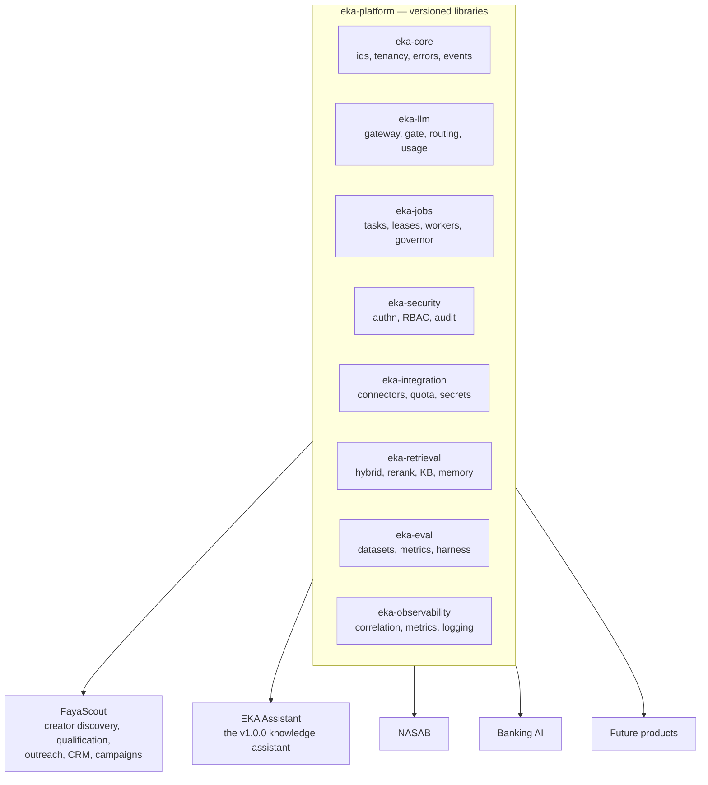

# EKA × FayaScout Platform Analysis

Sep 26, 2026 · @Mudassir

Architecture-level review of Project EKA and FayaScout, and how FayaScout should evolve on top of EKA. No implementation — analysis and recommendation only.

## 1. Executive Summary

**The reuse flow runs mostly backwards from what the framing assumed.**

The premise was "EKA is the platform, FayaScout is the first product built on it." After reading both repositories, that is about a quarter true today. The measured reality:

|  | Project EKA | FayaScout |
| --- | --- | --- |
| Size | 376 Java files, \~27k LOC | 557 main files, \~117k LOC (**4.3x**) |
| State | v0.8.4, Phase 7 **not closed** | 0.1.0-SNAPSHOT, live in production |
| Shape | Request/response RAG service | Continuous agentic pipeline |
| Structure | Strict hexagonal, 4 layers, ArchUnit-enforced | Package-by-feature, no layering enforcement |
| Background work | 3 `@Scheduled` methods | **22 `@Scheduled` methods**, 5 durable worker runtimes |
| Retrieval / vectors / RAG | The entire product | **Zero.** No Weaviate, no embeddings, no Spring AI |
| Multi-tenancy | Throughout | **Zero.** No `tenant` reference anywhere in `src/main` |
| Tests | 84 files, 726 tests, 8 ArchUnit rules | 237 files, 2,059 tests, **no** ArchUnit |

FayaScout uses **none** of EKA's existing capabilities — not retrieval, not conversation memory, not the knowledge base, not document processing, not tenancy. Meanwhile the platform capabilities FayaScout genuinely needed, it built for itself: a priority-aware LLM concurrency gate, LLM usage and cost accounting, a durable task runtime, external-API quota management with credential rotation, credential encryption at rest, a resource-aware execution governor, a permission-catalogue RBAC with delegated administration, a working security audit log, and a real labelled AI evaluation benchmark.

EKA has none of those. Several are things EKA's own records already identify as unsolved: its audit log is documented as shipped-but-never-called (ADR HD09), its retrieval-quality criterion is recorded **OPEN with a measured negative result** (ADR RQ06/RQ07), and multi-model routing is deferred to a hypothetical future adapter (ADR G15).

**The conclusion is a two-way exchange, not a one-way migration:**

- **FayaScout → EKA** — the *platform runtime* layer: jobs, LLM gateway, quota, secrets, RBAC/audit, evaluation. FayaScout has production-tested implementations; EKA has nothing. Most of the value is here, and it runs opposite to the original premise.
- **EKA → FayaScout** — retrieval, knowledge base, conversation memory, document processing. Real, high quality, and currently unused by FayaScout. The first genuine consumer is the business knowledge already sitting as flat Markdown in `docs/knowledge/junaid-playbooks/` — outreach copy and brand-negotiation playbooks that no code can query today.

**The blocking mechanical fact:** EKA is a single Gradle module (`rootProject.name = 'project-eka'`, one `build.gradle`) that produces only a `bootJar`. It cannot be consumed as a library by anything, at all, today. Nothing else in this report can begin until that changes.

**The strategic tension worth naming up front:** EKA's frozen v1.0.0 definition describes *"mid-size to large organizations running an internal, self-hosted knowledge assistant."* That is an **application** definition, not a platform definition. You cannot ship that v1.0.0 and simultaneously have EKA be the reusable substrate for FayaScout, NASAB and Banking AI — not because the code is wrong, but because the identity is. Section 12 recommends splitting it.

## 2. EKA Platform Assessment

**Verdict: an exemplary hexagonal *application*, not yet a platform.** The layering discipline is the best I have seen in a solo-authored Java codebase. What is missing is not quality — it is the runtime substrate any non-RAG product needs, and the packaging that would let anything consume it.

### Strengths

**Architecture and DDD — verified, not asserted.** I checked the claims rather than trusting them:

- `domain/` has **zero** non-JDK imports. No Spring, no JPA, no Spring AI. 78 files of pure Java.
- `api/` has **zero** imports of `infrastructure`. The dependency direction actually holds.
- 8 ArchUnit rules enforce every layer edge and run in CI on every PR.
- Ports are real ports: `LlmPort`, `RetrievalPort`, `RerankPort`, `QueryRewritePort`, `RankingPort`, `ContextAssemblyPort`, `PromptBuilderPort`, `CitationPort`, `OutputGuardrailsPort`, `ConversationHistoryPort`, `ClassificationPolicyPort`. Each has a documented contract; `RetrievalPort`'s Javadoc specifies the score-normalisation and rank invariants that RRF depends on.

**Provider independence is genuine.** `PromptBuilderPort` returns a provider-neutral `PromptRequest` and the adapter converts (ADR G01). Swapping Ollama for Bedrock is an adapter, not a refactor.

**Governance is a real asset.** 668 lines of ADRs and an 835-line `PROJECT_STATE.md` that records negative results honestly — ADR RQ06 states the re-ranking benchmark *failed* (baseline nDCG@4 = 0.431, no improvement) and RQ07 leaves the phase criterion **open** rather than declaring victory. ADR GOV09 declares Phase 7 **NOT COMPLETE** at its own gate. That intellectual honesty is worth more than most of the code.

**Security layering is correct in shape.** Authentication (JWT + session-bound `sid`, killable tokens, rotation with reuse detection — ADR RT01–RT05), authorization (role interceptor + tenant + ownership), and the classification-clearance Authorization Filter (ADR AF01–AF07, fail-closed on unknown). Prompt-injection fencing is structural and documented (ADR PI01–PI04) with residual risk explicitly accepted rather than hand-waved.

**Multi-tenancy is threaded through properly** — `TenantId` is an explicit parameter on every port and service, not a `ThreadLocal`. Verbose, but auditable, and ADR HD10 honestly corrects an earlier README claim: isolation is a mandatory query-time filter, not Weaviate's native multi-tenancy API.

### Weaknesses

**1. It cannot be consumed.** One Gradle module, `bootJar` only, no `java-library`, no `maven-publish`. This is the single hardest blocker in the whole analysis.

**2. There is no runtime substrate.** For a platform meant to host agentic products, EKA has: no task queue, no durable job model, no worker/lease pattern, no retry policy beyond one adapter's internal 3 attempts (ADR R02), no LLM concurrency control, no quota management, no cost/token accounting, no structured-output contract layer, no connector framework. Three `@Scheduled` methods total, two of them janitorial.

**3. Significant dead code.** 17 domain event records with **zero** `@EventListener` consumers. An audit-log schema, port and adapter with **zero** application call sites (ADR HD09 admits this). `application.chat` and `application.query` built and unwired. This is \~15% of the application layer built ahead of consumers that never arrived.

**4. The product's core quality claim is unmet.** ADR RQ07: retrieval-quality improvement is **not** demonstrated. The evaluation dataset is explicitly synthetic (ADR RQ05). The re-ranking result was negative (RQ06). For a retrieval platform, this is the most important open item in the repository.

**5. RBAC is coarse for a platform.** A fixed `UserRole` enum, a `@RequireRole` annotation, and an in-code role→clearance map (ADR AF02). No permission catalogue, no per-user grants, no delegated administration. FayaScout's is strictly more capable — see Section 3.

**6. Single-instance constraints are accepted, not solved.** `LoginRateLimiter` is in-memory per-instance (ADR EX05). The v1.0.0 definition names single-instance as the supported shape. Fine for a product; a limitation for a platform.

### Smaller findings

| Finding | Severity |
| --- | --- |
| Two port naming conventions coexist: `*Port` in `domain/*/port/` vs bare `VectorStore`, `EmbeddingProvider`, `FileStorage`, `DocumentParser` in `domain/*/` | Low — cosmetic, but confusing at a module boundary |
| No ArchUnit rule forbids `api` → `infrastructure` (currently clean, but unenforced), nor that adapters implement ports | Low — a latent regression path |
| Root package `com.mudassirshahzad.eka` is a personal namespace, not a platform one | Low now, expensive to change after a 1.0 API commitment |
| A stray compiled `ChatGenerationMetadata.class` sits at the repo root (gitignored, untracked) | Trivial — delete it |

### Production readiness

Honest score: **strong for a single-tenant, single-instance internal deployment; not yet for a platform.** Observability is well done (correlation IDs first in the filter chain, Micrometer observations, ECS structured logging, health indicators, a strict never-log policy for prompts/content). Operational resilience landed in WP-3 (Weaviate timeouts, reconciliation with a staleness gauge — ADR OR01–OR03). CI runs build, tests, ArchUnit, dependency review and a real Docker build. The two things standing between EKA and its own Phase 7 gate are branch protection (an owner action, ADR GOV08) and the retrieval-quality criterion (ADR RQ07) — and Section 6 shows how FayaScout can close the second one.

## 3. FayaScout Assessment

**Verdict: architecturally weaker in *packaging*, architecturally stronger in *runtime*.** FayaScout has no layer separation and no ArchUnit, but it has solved a set of hard operational problems — durable agentic work under a resource ceiling on a 4-core VPS — that EKA has never had to face.

### Module inventory

23 feature packages, 557 main files, \~117k LOC. Sizes measured, not estimated:

| Module | Files | LOC | What it does |
| --- | --- | --- | --- |
| `domain` | 111 | 9,715 | **Not a domain layer.** JPA entities + Spring Data repositories + enums, flat in one package |
| `intel` | 62 | 9,832 | Brand identity, relationship graph, research queue, production cycle coordinator, quota planning |
| `agent` | 61 | 8,316 | RASAD/FURQAN runtime: workers, task lifecycle, resource guard, model adapters (fake/Ollama/Anthropic) |
| `outreach` | 53 | 5,544 | Creator outreach lifecycle, follow-up cadence, drafts, send intents, reply sync |
| `security` | 38 | 3,415 | RBAC: permission catalogue, delegated admin, effective permissions, security audit |
| `youtube` | 30 | 2,499 | YouTube API client + `capacity/` quota buckets, multi-project credential rotation |
| `discovery` | 26 | 4,729 | Frontier scheduling, keyword expansion, territory generation, seed mining |
| `admin` | 25 | 5,457 | Thymeleaf controllers, creator query/mutation, filters, benchmarks |
| `enrichment` | 25 | 4,192 | Contact discovery, website fetching, audience geography, outreach readiness |
| `email` | 22 | 2,079 | Gmail OAuth, mailbox credentials, credential cipher, suppression |
| `classification` | 20 | 2,903 | Travel sub-niche classification, fingerprint reuse, stale recompute |
| `personalization` | 16 | 2,405 | Researched-video evidence, personalization model, travel gazetteer |
| `location` | 13 | 1,381 | Creator location resolution, residence scanning, target-market matching |
| `jobs` | 11 | 2,454 | Discovery job worker, task lifecycle, nightly scheduler |
| `evaluation` | 10 | 2,415 | Profile evaluation reconciliation, tier/geo/niche recovery |
| `performance` | 9 | 1,310 | Performance snapshot collection |
| `ollama`, `seed`, `stats`, `scoring`, `filter`, `research`, `brandhistory` | 24 | 3,246 | LLM call gate, scoring, filtering, stats |

### What is genuinely excellent

**`OllamaCallGate` — the single best platform candidate in either repository.** A process-wide, priority-aware concurrency gate over local inference. Its own Javadoc documents the exact failure it fixed: five independent `Semaphore(1)` instances across scout, confirmation, classification, location and personalization meant up to five inference requests hitting one CPU-only `qwen2.5:3b`, making everything 3–5x slower and permanently wedging FURQAN candidates. It now enforces at-most-one concurrent inference globally, hands the next permit to `PRODUCTION` callers ahead of `BACKGROUND` ones, and does not starve background work outright. **EKA has nothing remotely like this** — and would need it the moment a second concurrent consumer appears.

**`AgentResourceGuard` — an application-level resource governor.** `NORMAL → WARNING → THROTTLED → PAUSED_RESOURCE_LIMIT` with a sustained window up and hysteresis down, per-run ceilings on duration/videos/model-calls/failures/API-units, and — critically — **it never kills work**: an in-flight task always finishes and checkpoints. Pause/resume/stop are durable and distinguish operator cause from resource cause. This is rare, correct, and entirely reusable.

**The durable-work pattern, done right.** Claim a lease in one transaction → process **outside** any transaction (model + HTTP calls) → record the outcome in a new transaction → reclaim expired leases on a sweep. `AgentTaskProcessor` is explicitly *not* `@Transactional` and says why. `OutreachSendWorker` adds a fourth boundary: reconcile ambiguous sends by asking Gmail whether the Message-ID exists rather than re-sending. That is production-grade thinking.

**RBAC that outclasses EKA's.** A stable code-defined permission catalogue, per-user explicit grants/revokes over a role's default bundle, delegated administration bounded by what the delegating admin already holds, server-side effective-permission checks on every action, a request-scoped permission cache, and an append-only `SecurityAuditEvent` log that is **actually written to** — the thing EKA's ADR HD09 admits it never wired up.

**A real AI evaluation result.** A frozen 26-video ground-truth benchmark with measured Fast Scout recall 1.00, `CONFIRMED` precision 1.00, confirmed-sponsor recall 0.94, zero false confirms. Compare EKA's ADR RQ05/RQ06: synthetic dataset, negative result, criterion open. **FayaScout solved the evaluation problem EKA's Phase 7 declared unsolved.**

**Ports without hexagonal packaging.** `ScoutModel`, `ConfirmationModel`, `PersonalizationModel`, `EmailProvider`, `VideoEvidenceSource`, `AgentToolsClient`, `ResourceMetricsProvider`, `CreatorClassifier`, `CloudChatTransport` — all provider-independent interfaces with fake implementations for testing. The instinct is right; only the package layout is missing.

### What is weak

**1. `domain/` is not a domain.** 111 files: 35 import `jakarta.persistence`, 32 import Spring. `Creator.java` is 798 lines of JPA annotations. There is no domain model separate from persistence, and no layer boundary anywhere in the codebase.

**2. No ArchUnit, no enforced structure.** 2,059 tests across 237 files — good coverage — but nothing prevents any package importing any other. Cross-module coupling is already heavy: `jobs/TaskProcessor` imports from 13 different feature packages.

**3. The durable-work pattern is implemented five times.** `jobs/TaskLifecycleService` + `TaskProcessor` + `DiscoveryJobWorker`; `agent/AgentTaskLifecycleService` + `AgentTaskProcessor` + `AgentWorker`; `outreach/OutreachSendLifecycleService` + `OutreachSendWorker`; `outreach/OutreachReplySyncWorker`; `performance/PerformanceSnapshotWorker`. Same shape, five codebases to fix a bug in.

**4. LLM access is scattered across at least seven call paths** — `agent/model/OllamaJsonClient`, `agent/model/cloud/AnthropicMessagesClient`, `classification/OllamaQwenClassifier`, `location/LocationLlmAssistant`, `personalization/LocalOllamaPersonalizationModel`, `discovery/KeywordExpansionService`, `outreach/OutreachDraftLlmConfig` — each with its own prompt assembly, JSON parsing, timeout and retry handling.

**5. Two independent credential ciphers.** `EmailCredentialCipher` and `youtube/capacity/YouTubeCredentialCipher` exist separately because there was no platform primitive to share.

**6. God classes.** `intel/ProductionCycleService` 1,339 lines; `jobs/TaskProcessor` 1,093; `admin/CreatorAdminController` 955; `classification/NicheEvidenceAssessor` 897; `discovery/FrontierService` 818.

**7. \~90 `deploy-*.sh` scripts at the repository root**, 10–40 KB each, one per increment, going back to early September. This is release history stored as executable shell. It is the loudest operational-debt signal in either repo.

**8. Documentation drift.** `docs/roadmap.md` states *"No automated outreach exists"* while the README and the last five commits describe shipped Gmail OAuth, durable sending and automated follow-ups.

**9. Version skew.** Spring Boot 3.3.5 vs EKA's 3.5.0 — a real, if routine, prerequisite for any shared-library plan.

## 4. Platform Gap Analysis

Every gap below was found by comparing the two repositories — something FayaScout needed and built, or duplicated, because EKA offered no primitive. None are hypothetical.

### Critical

**C1 — EKA is not consumable as a library.** One Gradle module, `bootJar` only. Evidence: `settings.gradle` contains a single line. Every other recommendation in this report is blocked on this.

**C2 — No durable background-work runtime.** EKA has 3 `@Scheduled` methods (two janitorial) and no task model at all. FayaScout implemented the claim/lease/process-outside-transaction/reclaim pattern **five separate times**. Any product doing asynchronous AI work needs this on day one.

**C3 — No LLM gateway.** EKA's `LlmPort` is `LlmResponse generate(LlmRequest)` — nothing more. Missing: concurrency control, priority classes, per-call token/cost accounting, usage persistence, model routing, provider fallback, a call-level circuit breaker. FayaScout needed all of them and built `OllamaCallGate`, `LlmUsageLog`, `LlmModelRoutingLogger`, `AgentModelConfigService`, `ModelCallStats`. EKA's own ADR G15 defers routing to a "future `RoutingLlmAdapter`" that does not exist.

**C4 — No external-API quota or capacity management.** FayaScout's `youtube/capacity/` package is 17 classes: quota buckets, per-project usage tracking, multi-project credential rotation, project health, a settings surface. Plus `intel/QuotaCapacityPlanner` and `domain/ApiUsageLog`. EKA has no concept of a metered upstream anywhere — a fundamental gap for any product integrating a rate-limited third party.

### High

**H1 — No secrets/credential management primitive.** FayaScout has two independent AES ciphers (`EmailCredentialCipher`, `YouTubeCredentialCipher`) purely because nothing shared existed. EKA's v1.0.0 definition asks only for a *documented upgrade path* beyond env vars — not an implementation.

**H2 — No structured-output / model-contract layer.** Getting reliable JSON out of a local model is the single most common failure mode in both systems. FayaScout hand-rolled `ScoutJsonParser`, `ConfirmationJsonParser`, `OllamaModelOutput`, `KeywordExpansionModelOutput`, plus validation and repair for each. EKA has nothing — its LLM output is free text plus `[SOURCE:N]` markers.

**H3 — EKA's audit log is dead; FayaScout's works.** ADR HD09 records that EKA's audit schema, port and adapter have zero application call sites. FayaScout's `SecurityAuditService` + `SecurityAuditEvent` log sign-in/out, account changes, permission changes and delegation changes, append-only, never a secret. The platform should adopt FayaScout's implementation, not EKA's shell.

**H4 — EKA's RBAC is too coarse for a platform.** Fixed enum roles and a hardcoded role→clearance map versus FayaScout's permission catalogue, per-user grants/revokes, delegated administration with bounded scope, and effective-permission resolution. For a platform serving several products with different role vocabularies, the fixed enum will not survive contact with the second product.

**H5 — No connector/integration framework.** OAuth token lifecycle, refresh, provider-API error taxonomy, pagination, backoff — FayaScout built all of it bespoke for Gmail (`GmailOAuthClient`, `GmailTokenService`, `GmailApiClient`) and again for YouTube. NASAB and Banking AI will need the same shape for different providers.

**H6 — No AI evaluation capability at platform level.** EKA has `RetrievalMetrics` and a **synthetic** dataset that produced a **negative** result (ADR RQ05/RQ06), with the phase criterion left open (RQ07). FayaScout has a labelled, frozen, real-evidence benchmark with precision/recall figures. The methodology belongs in the platform — and would close EKA's own open criterion.

### Medium

**M1 — No resource-aware execution governor.** `AgentResourceGuard`'s hysteresis state machine and never-kill-in-flight-work guarantee are genuinely reusable and genuinely uncommon. Any product running local inference on constrained hardware needs it.

**M2 — No operator control-plane primitives.** Durable pause/resume/stop distinguishing operator cause from system cause, plus a bounded runtime-event timeline (`agent_runtime_events`). EKA has no notion of an operator pausing anything.

**M3 — No workflow/state-machine primitive.** FayaScout has at least four hand-rolled state machines with transition validators: `OutreachTransitions`, `BrandOutreachTransitions`, `StatusTransitionValidator`, `ProductionCycleState`. Each re-implements guard-and-transition logic.

**M4 — Spring Boot version skew.** EKA 3.5.0, FayaScout 3.3.5. Routine, but a hard prerequisite for shared libraries.

**M5 — Namespace.** `com.mudassirshahzad.eka` is a personal namespace. Changing it after a 1.0 API commitment is far more expensive than changing it now.

### Low

**L1** — EKA's two port naming conventions (`*Port` vs bare `VectorStore`/`EmbeddingProvider`/`FileStorage`/`DocumentParser`) will confuse module boundaries once packages split.

**L2** — EKA's ArchUnit suite lacks an `api → infrastructure` rule and an adapter-implements-port rule. Both currently hold by discipline alone.

**L3** — No shared observability conventions. EKA has correlation IDs, Micrometer observations and a strict logging policy; FayaScout has none of that. Whichever product is second will reinvent it.

**L4** — No shared error/problem-detail contract. EKA uses RFC 7807 throughout (ADR O03); FayaScout is a server-rendered Thymeleaf app with its own conventions.

### Capability matrix

| Capability | EKA | FayaScout | Platform home |
| --- | --- | --- | --- |
| Retrieval (hybrid, RRF, re-rank, HyDE) | Strong | Absent | **EKA** |
| Knowledge base / document processing | Strong | Absent | **EKA** |
| Conversation memory | Strong | Absent | **EKA** |
| Multi-tenancy | Strong | Absent | **EKA** (dormant for FayaScout) |
| Prompt building + injection fencing | Strong | Ad hoc, per call site | **EKA** |
| Output guardrails + citations | Strong | Absent | **EKA** |
| Authentication (JWT, refresh, revocation) | Strong | Session/form login | **EKA** |
| Authorization (RBAC) | Coarse | **Strong** | **FayaScout's model** |
| Security audit log | Dead code | **Working** | **FayaScout's model** |
| Durable jobs / workers | Absent | **Strong** (x5) | **FayaScout's model** |
| LLM concurrency + priority gate | Absent | **Strong** | **FayaScout's model** |
| LLM usage / cost accounting | Absent | **Present** | **FayaScout's model** |
| External API quota + credentials | Absent | **Strong** | **FayaScout's model** |
| Credential encryption at rest | Absent | Present (x2) | **FayaScout's model** |
| Resource governor | Absent | **Strong** | **FayaScout's model** |
| Structured model output contracts | Absent | Present, duplicated | **New — neither** |
| AI evaluation harness | Synthetic, negative | **Real, labelled** | **FayaScout's method** |
| Connector framework | Absent | Bespoke x2 | **New — neither** |
| Observability conventions | **Strong** | Absent | **EKA** |

## 5. Module Mapping

Every FayaScout module, against the rule you set: move to the platform only if reusable **and** product-agnostic **and** useful to a future product **and** genuinely platform-shaped.

**Read the "Reuse from EKA" column carefully — it is empty far more often than the framing predicted.** That is the finding, not an omission.

| FayaScout module | Reuse from EKA | Stay in FayaScout | Missing platform capability | Verdict |
| --- | --- | --- | --- | --- |
| `discovery` — frontier scheduling, keyword expansion, territory generation, seed mining | — | **All of it.** YouTube-specific frontier economics, travel-niche keyword derivation, yield-gated scheduling | C2 durable jobs, C3 LLM gateway, C4 API quota | **Stay.** Consume 3 platform primitives |
| `classification` — travel sub-niche, fingerprint reuse, stale recompute | — | **All of it.** `TravelSubNiche`, niche evidence rules are pure product | C3 LLM gateway, H2 structured output, C2 jobs | **Stay.** `ClassificationFingerprint`'s reuse-caching idea is worth generalising later, not now |
| `scoring`, `filter` — deterministic gates, FayaHub score | — | **All of it.** Business rules, by definition | — | **Stay entirely** |
| `enrichment` — contact discovery, website fetching, audience geography, readiness | — | Contact-route semantics, business-inquiry detection, readiness rules | H5 connector framework (HTTP fetch, retry, robots, backoff) | **Stay.** Extract only the generic web-fetch primitive |
| `location` — creator location resolution, target-market matching | — | **All of it.** Evidence hierarchy is product logic | C3 LLM gateway | **Stay** |
| `agent` — RASAD/FURQAN runtime | — | `ScoutModel`/`ConfirmationModel` prompts, brand extraction, corroboration gate, `DeterministicBrandExtractor` | **C2 jobs, M1 resource governor, M2 operator control plane, C3 LLM gateway, H2 structured output** | **Split.** The *runtime* is platform; the *agents* are product. Highest-value extraction in the report |
| `intel` — brand identity, relationship graph, research queue, production cycle | — | **Almost all.** Brand/creator relationship modelling is FayaHub's business | C2 jobs, C4 quota planning, M3 state machines | **Stay.** `QuotaCapacityPlanner` generalises into C4 |
| `personalization` — researched video evidence, personalization writer | **Yes, eventually** — retrieval + prompt builder + guardrails for evidence-bound generation | Travel gazetteer, personalization grading, hook rules | C3, H2 | **Stay.** First real EKA consumer once the playbook KB exists |
| `outreach` — lifecycle, cadence, drafts, send intents, reply sync | **Yes, eventually** — prompt builder, output guardrails, retrieval over the playbooks for draft copy | **All business logic.** Cadence, transitions, reply classification, send gating | C2 jobs, H5 connectors, M3 state machines | **Stay.** Second EKA consumer |
| `email` — Gmail OAuth, mailbox credentials, cipher, suppression | — | Suppression policy, mailbox–owner binding | **H1 secrets, H5 connector framework** | **Split.** Cipher + OAuth lifecycle → platform; Gmail-as-outreach-channel stays |
| `youtube` + `youtube/capacity` | — | YouTube API semantics, video/channel models | **C4 quota + credential rotation** | **Split.** The capacity/quota engine is a platform capability with a YouTube adapter |
| `jobs` — discovery worker, task lifecycle, nightly scheduler | — | `TaskProcessor`'s business steps | **C2 — the whole lifecycle/worker/lease machinery** | **Split.** Mechanism to platform, steps stay |
| `evaluation` — profile reconciliation, tier/geo/niche recovery | Pattern only — EKA's `ReconciliationJob` + staleness gauge (ADR OR03) | **All business rules** | C2 jobs, generic reconciliation scaffold | **Stay.** Adopt EKA's staleness-gauge alerting pattern |
| `performance` — snapshot collection | — | Snapshot semantics | C2 jobs | **Stay** |
| `security` — RBAC, permissions, delegated admin, audit | Authentication only (JWT/refresh/revocation, if FayaScout ever needs API auth) | Permission *catalogue contents* — the specific permission keys are product | **H3 audit, H4 authorization model** — and FayaScout is the **donor** here | **Split, reverse direction.** FayaScout's model becomes the platform's |
| `admin` — Thymeleaf controllers, creator query/mutation, filters | — | **All of it.** Operator UI is the product | — | **Stay entirely** |
| `ollama` — call gate, routing logger, status | — | Nothing | **C3 — this *is* the LLM gateway** | **Move to platform, near-wholesale** |
| `domain` — entities, repositories, enums | — | **All of it.** Creator/brand/outreach model is the product | — | **Stay.** Restructure internally (Section 9), do not move |
| `seed`, `stats`, `research`, `brandhistory` | — | All | — | **Stay entirely** |

### Summary of the mapping

| Direction | Modules | Weight |
| --- | --- | --- |
| **Stays in FayaScout, unchanged** | `discovery`, `classification`, `scoring`, `filter`, `location`, `intel`, `admin`, `domain`, `performance`, `seed`, `stats`, `research`, `brandhistory` | \~65% of the codebase |
| **Splits — mechanism out, business logic stays** | `agent`, `jobs`, `email`, `youtube`, `security` | \~25% |
| **Moves to platform near-wholesale** | `ollama` | \~1% |
| **Becomes an EKA consumer (new capability, not a move)** | `personalization`, `outreach` | \~9% |

**Nothing in FayaScout's business domain should move into EKA.** Creator discovery, qualification, outreach, campaigns, CRM, follow-ups, media-kit analysis and travel-profile logic all stay exactly where they are — as you specified, and as the evidence independently supports.

## 6. Migration Blueprint

### 6.1 Integration model — recommendation

You asked me to choose. **Versioned libraries now; a deployed service later, behind ports designed so the switch is an adapter swap.**

Why libraries, given your constraints:

- **The hardware decides it.** FayaScout runs on a 4-core VPS whose single CPU-only Ollama instance is already the system bottleneck — `OllamaCallGate` exists precisely because that box cannot serve concurrent inference. Adding a second JVM and a network hop buys nothing and costs RAM the box does not have.
- **"Live, low disruption" rules out a distributed topology.** A strangler migration inside one process is reversible per-step. A service extraction is not.
- **The capabilities FayaScout needs are cross-cutting, not stateful.** Jobs, LLM gating, quota, secrets, RBAC — these are libraries by nature. The stateful ones (retrieval, knowledge base) are the ones FayaScout does not use yet.
- **Single-tenant today.** The strongest argument for a service — one platform instance serving many tenants — does not apply yet.

**When to revisit:** when a *second* product (NASAB, Banking AI) ships, or when retrieval genuinely needs its own scaling profile. Design `eka-retrieval`'s public surface as a port from day one so that day is an adapter, not a rewrite.

### 6.2 Target architecture

The important structural claim: **the knowledge assistant EKA is building toward v1.0.0 becomes a product on the platform, not the platform itself.** It is the second consumer, alongside FayaScout — which is what proves the platform is actually a platform rather than one application with good layering.

| Library | Seeded from | Consumed by FayaScout | Consumed by the Assistant |
| --- | --- | --- | --- |
| `eka-core` | EKA `domain/shared` | Yes | Yes |
| `eka-llm` | **FayaScout** `ollama` + `agent/model` + EKA `LlmPort` | Immediately | Yes |
| `eka-jobs` | **FayaScout** `jobs` + `agent` + `agent/resource` | Immediately | Reconciliation, purge jobs |
| `eka-security` | **FayaScout** `security` + EKA `api/security` | Yes | Yes |
| `eka-integration` | **FayaScout** `youtube/capacity` + `email` | Immediately | Rarely |
| `eka-retrieval` | **EKA** — wholesale | Later (playbook KB) | Core |
| `eka-eval` | **FayaScout** method + EKA `RetrievalMetrics` | Yes | Yes — closes ADR RQ07 |
| `eka-observability` | **EKA** | Yes | Yes |

### 6.3 Migration steps

Every step is independently shippable and reversible. No step requires a FayaScout feature freeze.

**Step 0 — Make EKA consumable** *(EKA only; zero FayaScout risk)*

- **Objective:** Multi-module Gradle build; `java-library` + `maven-publish`; decide the platform namespace; align Spring Boot to 3.5.x on both sides.
- **Affected:** EKA `settings.gradle`, `build.gradle`; FayaScout `build.gradle.kts` (version bump only).
- **Risks:** Low. The namespace decision is the only one-way door — make it here, not later. Boot 3.3.5 → 3.5.0 on FayaScout is a routine upgrade but touches a live system; do it as its own release with the full 2,059-test suite as the gate.
- **Benefit:** Unblocks everything. Without this, nothing else can start.

**Step 1 — `eka-llm`, the LLM gateway** *(highest value, lowest risk)*

- **Objective:** Promote `OllamaCallGate` (priority gate), `LlmUsageLog` (usage/cost), `ModelCallStats`, and model routing into a library behind EKA's existing `LlmPort`. Add the structured-output contract layer (H2) by generalising `ScoutJsonParser`/`ConfirmationJsonParser`.
- **Affected:** FayaScout `ollama`, `agent/model`, `classification`, `location`, `personalization`, `discovery`, `outreach` — but **only at the transport seam**. `ScoutModel`, `ConfirmationModel` and `PersonalizationModel` interfaces are untouched; their implementations call the gateway instead of raw HTTP.
- **Risks:** Medium. This sits on the hottest path in production. Mitigate by keeping `OllamaCallGate`'s exact semantics — global at-most-one, priority handoff, no starvation — and shipping it behind a feature flag that falls back to the current client for one release.
- **Benefit:** Seven LLM call paths collapse to one. Cost accounting becomes universal. EKA finally gets the routing ADR G15 promised. Every future product inherits it.

**Step 2 — `eka-jobs`, the durable task runtime**

- **Objective:** Extract the claim/lease/process-outside-transaction/reclaim pattern plus `AgentResourceGuard` and the operator control plane (pause/resume/stop, runtime events).
- **Affected:** Migrate **one worker first** — `performance/PerformanceSnapshotWorker`, the lowest-consequence of the five. Prove it over a full production week. Then `outreach/OutreachReplySyncWorker`, then `OutreachSendWorker`, then `jobs/DiscoveryJobWorker`, and `agent/AgentWorker` last — it is the most valuable and the most dangerous.
- **Risks:** **Highest in the plan.** These workers own money-adjacent state (outreach sends) and expensive work (agent runs). A lease bug re-sends an email or re-runs a paid model call. Mitigate: one worker per release; keep the old lifecycle service alive and dormant until the new one has run clean; assert exactly-once on send paths with the existing Message-ID reconciliation.
- **Benefit:** Five implementations become one. The resource governor and operator controls become available to every product. This is the capability that makes EKA a *platform* rather than a RAG library.

**Step 3 — `eka-security`, RBAC and audit** *(reverse flow — FayaScout is the donor)*

- **Objective:** FayaScout's permission catalogue, per-user grants/revokes, delegated admin scopes, effective-permission resolution and working security audit become the platform model. EKA adopts it, replacing its fixed-enum RBAC and deleting the dead audit adapter (ADR HD09).
- **Affected:** FayaScout `security` (extraction, minimal behaviour change); EKA `api/security`, `infrastructure/authorization`, `domain/shared/AuditLog`.
- **Risks:** Medium on EKA's side — ADR AF02's role→clearance map must be re-expressed as permissions without weakening the fail-closed guarantee of ADR AF07. Low on FayaScout's side, since its model is the one being kept.
- **Benefit:** One authorization model across products. EKA's audit log stops being documented dead code. Classification clearance becomes a permission, which is what it always wanted to be.

**Step 4 — `eka-integration`, quota, credentials and connectors**

- **Objective:** Generalise `youtube/capacity`'s quota buckets, usage tracking and multi-project credential rotation into a provider-agnostic metered-upstream capability. Unify the two ciphers into one secrets primitive. Extract the OAuth token lifecycle from the Gmail connector.
- **Affected:** FayaScout `youtube/capacity`, `email`; a YouTube adapter and a Gmail adapter remain in FayaScout.
- **Risks:** Medium. Credential re-encryption is a data migration on live secrets — needs a dual-read window and a verified rollback. The recent `deploy-gmail-yt-cipher-material.sh` commit suggests this area has already bitten once.
- **Benefit:** Every future product integrating a metered API gets quota, rotation and encrypted credentials for free.

**Step 5 — FayaScout becomes an EKA retrieval consumer** *(the first genuine forward flow)*

- **Objective:** Ingest `docs/knowledge/junaid-playbooks/` — influencer operations, copywriting, brand outreach, benchmarks — into `eka-retrieval` and ground outreach draft generation and personalization in it.
- **Affected:** FayaScout `outreach/OutreachDraftGenerationService`, `OutreachDraftPromptBuilder`, `personalization`. New: Weaviate or a Postgres-only retrieval profile.
- **Risks:** Medium-high on *value*, low on *stability*. It is additive — nothing breaks if it underperforms. But EKA's own ADR RQ06 recorded no measured retrieval improvement, so treat quality as unproven until measured on this corpus. **Consider the Postgres BM25-only profile first** to avoid adding Weaviate to a 4-core VPS.
- **Benefit:** Outreach copy grounded in your actual playbooks instead of a generic prompt. This is the first time EKA delivers value to FayaScout, and the first real test of whether EKA's retrieval is good enough to build on.

**Step 6 — `eka-eval`, and closing EKA's own open criterion**

- **Objective:** Promote FayaScout's labelled-benchmark methodology (frozen ground truth, precision/recall, oracle controls) into the platform. Apply it to the Step 5 playbook corpus to produce EKA's first **real, non-synthetic** retrieval evaluation set.
- **Affected:** EKA `application/evaluation`, `src/test/.../evaluation`; FayaScout's benchmark ITs.
- **Risks:** Low technically; the real risk is that a real evaluation set confirms ADR RQ06's negative result on real data too. That is worth knowing.
- **Benefit:** Closes ADR RQ07 — one of the two criteria keeping Phase 7 open — with evidence rather than assertion. Gives every future product a way to prove its AI works.

## 7. Technical Debt

Only debt I verified in the repositories. Severity is about what it costs the *platform* plan, not general tidiness.

### Project EKA

| # | Debt | Evidence | Severity |
| --- | --- | --- | --- |
| E1 | Single Gradle module, `bootJar` only — unconsumable | `settings.gradle` is one line | **Critical** |
| E2 | 17 domain event records, zero `@EventListener` consumers | `application/event/` · `PROJECT_STATE.md` deferred-items table | High |
| E3 | Audit log: schema + port + adapter, zero call sites | ADR HD09, self-admitted | High |
| E4 | `application.chat` and `application.query` built, never wired | ADR P04.13.8 deferred items | Medium |
| E5 | Retrieval-quality criterion unmet; dataset synthetic; re-rank result negative | ADR RQ05/RQ06/RQ07 | **High** — it is the product's core claim |
| E6 | Phase 7 open: branch protection unapplied (verified 404 at the gate) | ADR GOV08/GOV09 | Medium — a 5-minute owner action |
| E7 | `LoginRateLimiter` in-memory, breaks silently on a second instance | ADR EX05 | Medium |
| E8 | Two port naming conventions coexist | `domain/*/port/*Port` vs `domain/chunk/VectorStore` | Low |
| E9 | ArchUnit missing `api → infrastructure` and adapter-implements-port rules | `HexagonalArchitectureTest` — 8 rules, all layer-direction | Low |
| E10 | Personal root namespace | `com.mudassirshahzad.eka` | Low now, high after 1.0 |
| E11 | Stray compiled class at repo root | `org/springframework/ai/.../ChatGenerationMetadata.class` (untracked, gitignored) | Trivial |

### FayaScout

| # | Debt | Evidence | Severity |
| --- | --- | --- | --- |
| F1 | Durable-work pattern implemented 5 times | `jobs`, `agent`, `outreach` x2, `performance` | **Critical** for the plan |
| F2 | 7+ independent LLM call paths | `agent/model`, `classification`, `location`, `personalization`, `discovery`, `outreach`, `agent/model/cloud` | **Critical** for the plan |
| F3 | No layer separation; `domain/` is 111 files of JPA entities + repositories + enums | 35 files import `jakarta.persistence`, 32 import Spring | **High** |
| F4 | No ArchUnit or any structural enforcement | Zero matches for `ArchRule` in 237 test files | **High** |
| F5 | \~90 `deploy-*.sh` scripts at repository root, 10–40 KB each | `ls` of the repo root | **High** — release process as shell archaeology |
| F6 | God classes | `ProductionCycleService` 1,339 · `TaskProcessor` 1,093 · `CreatorAdminController` 955 · `NicheEvidenceAssessor` 897 | Medium |
| F7 | Two independent credential ciphers | `EmailCredentialCipher`, `YouTubeCredentialCipher` | Medium |
| F8 | 4+ hand-rolled state machines with duplicated transition-guard logic | `OutreachTransitions`, `BrandOutreachTransitions`, `StatusTransitionValidator`, `ProductionCycleState` | Medium |
| F9 | `docs/roadmap.md` contradicts the README and the last five commits | Roadmap says "No automated outreach exists"; outreach automation shipped | Medium |
| F10 | Cross-module coupling unmanaged | `jobs/TaskProcessor` imports from 13 feature packages | Medium |
| F11 | Spring Boot 3.3.5 vs EKA 3.5.0 | `build.gradle.kts` | Medium — blocks Step 0 |
| F12 | Test suite needs `forkEvery = 60` and a 2 GB heap to avoid OOM | `build.gradle.kts` comment | Low — symptom of context-per-test sprawl |

### The asymmetry worth naming

EKA's debt is **debt of anticipation** — things built before a consumer existed (events, audit, chat/query use cases), meticulously documented as such. FayaScout's debt is **debt of velocity** — things built five times because shipping mattered more than factoring. Both are recoverable. The platform plan resolves a large share of FayaScout's velocity debt as a side effect of extraction, and resolves EKA's anticipation debt by finally supplying the consumers (E2's events, E3's audit) those components were built for.

## 8. Recommended EKA Improvements

Ordered by what unblocks the most. Items 1–4 should happen before v1.0.0; the rest can follow.

**1. Modularise the build.** Split into `eka-core`, `eka-retrieval`, `eka-llm`, `eka-security`, `eka-jobs`, `eka-integration`, `eka-eval`, `eka-observability`, plus an `eka-assistant` application module that assembles them. Apply `java-library` and `maven-publish`. Publish to GitHub Packages — no external infrastructure needed. *Closes E1.*

**2. Decide the platform namespace now.** `com.mudassirshahzad.eka` is a personal namespace on what is meant to be shared infrastructure. Renaming after a 1.0 API commitment costs every consumer a breaking change. ADR R01 already performed one namespace rename cleanly — the precedent and the mechanics exist. *Closes E10.*

**3. Build the LLM gateway (C3).** Adopt FayaScout's `OllamaCallGate` semantics wholesale rather than designing fresh: global concurrency cap, priority classes, no starvation. Add persisted usage/cost accounting (`LlmUsageLog`) and the `RoutingLlmAdapter` that ADR G15 has promised since P04.9. Add a structured-output contract layer so callers declare a schema and get validated objects rather than strings.

**4. Build the durable job runtime (C2).** Task, lease, worker, reclaim, plus the resource governor and operator controls. Seed it from FayaScout's implementation — it is already correct and already survives crashes in production.

**5. Replace the RBAC model with FayaScout's.** Permission catalogue, per-user grants, delegated scopes, effective-permission resolution. Re-express ADR AF02's role→clearance map as permissions, preserving ADR AF07's fail-closed guarantee exactly. *Addresses E3 and H4 together.*

**6. Wire the audit log, or delete it.** It has been documented-but-dead since before v0.7.2. Step 3 gives it real call sites. If Step 3 slips, delete the schema and adapter rather than carrying them another release. *Closes E3.*

**7. Close Phase 7 honestly.** Branch protection is a five-minute repository-owner action (ADR GOV08) — apply it and the first of two open criteria closes today. The second, ADR RQ07, closes via Step 6's real evaluation set. Both are within reach; neither needs new engineering.

**8. Resolve the dead application layer.** `application.chat` and `application.query` have been "future roadmap" since P04.13. Either wire them in Step 5 (the playbook KB gives `KnowledgeQuery` a genuine caller) or delete them, following the ADR EX08 precedent that already deleted two use cases for adding no value. *Closes E4.*

**9. Strengthen ArchUnit before splitting modules.** Add `api → infrastructure`, adapters-implement-ports, and module-boundary rules. Module extraction is exactly when structural regressions slip in — the rules should exist before the split, not after. *Closes E9.*

**10. Unify the port naming convention.** Rename `VectorStore`, `EmbeddingProvider`, `FileStorage`, `DocumentParser` to `*Port` and move them under `domain/*/port/`. Pure rename, zero behaviour, and it matters once these become published library surfaces. *Closes E8.*

**11. Delete the stray `.class` file.** *Closes E11.*

## 9. Recommended FayaScout Improvements

These are worth doing **whether or not** the platform plan proceeds. Several are prerequisites for it.

**1. Introduce a package structure and enforce it with ArchUnit.** You do not need full hexagonal — FayaScout's package-by-feature layout is defensible for a product this business-heavy. What is missing is any rule at all. Start with three:

- no feature package may import another feature package's internals, only its published interfaces;
- nothing outside `domain` may import `jakarta.persistence`;
- `web`/controller classes may not import repositories directly.

That alone would have prevented `TaskProcessor` growing 13 cross-package dependencies. *Closes F4, contains F10.*

**2. Split `domain/`.** 111 files in one flat package is the root cause of F3 and much of F10. It does not require a hexagonal rewrite — split by aggregate first (`domain/creator`, `domain/brand`, `domain/outreach`, `domain/agent`, `domain/discovery`), and only then consider separating persistence from model where it actually pays. Do this incrementally, one aggregate per release.

**3. Replace the \~90 deploy scripts with one parameterised pipeline.** This is the highest-leverage operational fix available. Ninety scripts of 10–40 KB each, one per increment, means no single reproducible deployment path and no way to know which one last ran. Consolidate to one script plus a versioned changelog, and archive the history. *Closes F5.*

**4. Consolidate the LLM call paths** — do this even if `eka-llm` never happens. Seven independent transports over one CPU-bound model is the condition `OllamaCallGate` was built to survive, not to bless. Route every call through the gate, uniformly. *Closes F2, and is Step 1's precondition.*

**5. Unify the durable-work pattern internally before extracting it.** Collapse the five implementations into one FayaScout-internal abstraction first, prove it in production, *then* extract it to `eka-jobs`. Extracting five divergent implementations directly into a shared library is how a shared library becomes a liability. *Closes F1, de-risks Step 2 substantially.*

**6. Unify the two credential ciphers.** One primitive, one key-rotation story. Given the recent `deploy-gmail-yt-cipher-material.sh` work, this area is already fragile. *Closes F7.*

**7. Extract one transition-guard abstraction** for the four state machines. Small, contained, and it removes a class of bug where one path validates a transition and another does not. *Closes F8.*

**8. Fix the documentation drift.** `docs/roadmap.md` says no automated outreach exists; the README, the code and the last five commits say otherwise. A roadmap that contradicts the repository is worse than no roadmap. Either update it or mark it historical the way EKA marked its own `docs/roadmap.md` superseded. *Closes F9.*

**9. Upgrade to Spring Boot 3.5.x** as its own release, gated on the full suite. *Closes F11, unblocks Step 0.*

**10. Break up the god classes opportunistically.** `ProductionCycleService` (1,339 lines) and `TaskProcessor` (1,093) are the two worth attention — and `TaskProcessor` will shrink substantially as a side effect of item 5. Do not schedule a refactor sprint for this; do it as those files are touched. *Closes F6.*

**11. Adopt EKA's observability conventions** — correlation IDs, Micrometer observations, the never-log-content policy. FayaScout has 22 scheduled jobs and five workers with no correlation story. This is a small, high-value import from EKA that needs no library extraction at all. *Addresses L3.*

## 10. Prioritized Roadmap

### 10.1 The GOV03 amendment

You authorised this session to amend the frozen roadmap. My recommendation is **not** to reorder Phase 7 → 8 → v1.0.0, and not to widen the v1.0.0 definition. Instead, make one structural change:

> **Split EKA's identity.** `eka-platform` (the libraries) and `eka-assistant` (the v1.0.0 knowledge assistant, now the platform's second product). The frozen v1.0.0 definition applies to the *assistant*, unchanged — every criterion in it stays valid and shippable. The platform gets its own version line.

Why this rather than redefining v1.0.0 as "the platform": widening v1.0.0 to mean a multi-product platform would make it unshippable and would invalidate a definition you deliberately froze. Splitting the identity preserves the freeze completely while letting platform work proceed in parallel.

One amendment I *do* recommend inside the frozen sequence: **pull modularisation (Step 0) into Phase 8.** Retrofitting module boundaries after a 1.0 API commitment is an order of magnitude more expensive than doing it before. Phase 8 is already "Scale & Ecosystem Readiness" — making the platform consumable is squarely within that objective, not a new phase.

### 10.2 Sequence

| Order | Work | Repo | Depends on | Why here |
| --- | --- | --- | --- | --- |
| **1** | Apply branch protection | EKA | — | 5 minutes; closes half of what keeps Phase 7 open (ADR GOV08) |
| **2** | Fix roadmap drift; consolidate deploy scripts | FayaScout | — | Zero risk, immediate operational relief (F5, F9) |
| **3** | ArchUnit rules + `domain/` split, one aggregate at a time | FayaScout | — | Must precede extraction, or you extract tangles (F3, F4) |
| **4** | Consolidate LLM call paths behind `OllamaCallGate` | FayaScout | — | Step 1's precondition; standalone value (F2) |
| **5** | Unify the 5 worker implementations internally | FayaScout | 3 | Step 2's precondition; the single biggest de-risking move (F1) |
| **6** | Spring Boot 3.5.x upgrade | FayaScout | — | Step 0's precondition (F11) |
| **7** | **Step 0** — modularise EKA, namespace decision, publishing | EKA | 6 | Unblocks everything downstream (E1, E10) |
| **8** | Strengthen ArchUnit; unify port naming; delete or wire dead code | EKA | 7 | Do it *while* splitting modules, not after (E2, E4, E8, E9) |
| **9** | **Step 1** — `eka-llm` | Both | 4, 7 | Highest value, contained blast radius |
| **10** | **Step 6** — `eka-eval` | Both | 7 | Closes ADR RQ07 and thus Phase 7 |
| **11** | **Step 2** — `eka-jobs`, one worker per release | Both | 5, 9 | Highest risk; must follow 5 and 9 |
| **12** | **Step 3** — `eka-security` | Both | 7 | Reverse flow; EKA is the one changing most |
| **13** | **Step 4** — `eka-integration` | Both | 7, 11 | Involves live-secret migration; go last among extractions |
| **14** | **Step 5** — playbook knowledge base in FayaScout | Both | 7, 10 | The first forward flow; needs `eka-eval` to prove it works |

### 10.3 Three checkpoints

- **After 6** — FayaScout is internally consolidated and version-aligned. **Stop here and you have still won**: five workers become one, seven LLM paths become one, ninety deploy scripts become one. Real gains, zero platform risk.
- **After 9** — the first shared library is live in production. This is the decision point on whether the library model actually works for you in practice.
- **After 14** — the platform is real: two products (FayaScout and the Assistant) on shared infrastructure, with evidence rather than intent.

### 10.4 What not to do

- **Do not start with retrieval.** It is EKA's best work and FayaScout's least urgent need. Starting there optimises for the narrative, not the value.
- **Do not extract `agent/` early.** It is the most valuable runtime in either repository and the most dangerous to move. It goes last within Step 2.
- **Do not introduce multi-tenancy into FayaScout** to "align with the platform." You confirmed single-tenant for now. Carry EKA's tenancy as a dormant dependency; do not pay for it.
- **Do not add Weaviate to the VPS** without first testing the Postgres BM25-only retrieval profile. That box is already the constraint that forced `OllamaCallGate` into existence.

## 11. Risks

| # | Risk | Likelihood | Impact | Mitigation |
| --- | --- | --- | --- | --- |
| R1 | **Premature platformisation.** Extracting from one product produces a library shaped like that product, which the second product then fights. | **High** | **High** | Extract only what two consumers have independently needed. `eka-llm` and `eka-jobs` qualify (FayaScout needed them 5–7 times over). `eka-retrieval` does not yet — it has one consumer. Let the Assistant be the second consumer that validates it. |
| R2 | **Destabilising a live, money-adjacent system.** Step 2 touches workers that send real email and run paid model calls. | Medium | **Critical** | One worker per release, lowest-consequence first. Keep old lifecycle services dormant-but-present for a release. Preserve the Message-ID reconciliation that already guards against double-sends. |
| R3 | **Platform work displaces product work.** FayaScout is at Stage 1 of 4 and has not yet proven the commercial loop. Refactoring is not revenue. | **High** | **High** | Items 1–6 of the roadmap are FayaScout-internal and pay for themselves in velocity. Treat Step 0 onward as genuinely optional until the Stage 1 commercial gate passes. FayaScout's own prioritisation rule — *"does this materially help find, qualify, contact, match, negotiate, close?"* — should be applied to this entire report. |
| R4 | **The VPS cannot take more.** `OllamaCallGate` exists because a 4-core box could not serve five concurrent inferences. Adding Weaviate, or a second JVM, may break what works. | Medium | High | Library model, not service (§6.1). Test the Postgres-only retrieval profile before considering Weaviate. Treat host capacity as a hard design constraint, not an ops detail. |
| R5 | **EKA's retrieval may not be good enough to build on.** Its own ADR RQ06 records a negative re-ranking result on a synthetic set, and RQ07 leaves the criterion open. | Medium | High | Do Step 6 (`eka-eval`) *before* Step 5 commits to retrieval-backed features. Measure on the real playbook corpus. If quality does not hold, that is a finding worth having early and cheaply. |
| R6 | **Version skew across two repos.** Two Spring Boot versions, two release cadences, and a shared library between them. | **High** | Medium | Align on 3.5.x before Step 0 (roadmap item 6). Adopt semantic versioning on platform libraries with a documented support window. Expect this to be a permanent tax, not a one-time fix. |
| R7 | **Credential-migration failure in Step 4.** Re-encrypting live Gmail and YouTube credentials under a unified cipher. | Medium | **Critical** | Dual-read window, verified rollback, and a rehearsal against a copy of production data. The existing `deploy-gmail-yt-cipher-material.sh` history shows this area has already caused an incident once. |
| R8 | **Single-maintainer bandwidth.** Two repositories, 144k LOC, a frozen roadmap, a live production system, and now a platform programme. | **High** | **High** | The checkpoints in §10.3 exist for exactly this. Stopping after item 6 is a legitimate, valuable outcome — not a failure. |
| R9 | **Losing EKA's architectural discipline during extraction.** Module splits are precisely when layering rules quietly stop holding. | Medium | Medium | Strengthen ArchUnit *before* the split (roadmap item 8), add module-boundary rules as each module is created, keep CI as the gate. |
| R10 | **Governance overhead scaling badly.** EKA's ADR discipline is a genuine asset at 27k LOC and one repo. Across a platform plus four products it could become the bottleneck. | Medium | Medium | Keep ADRs for decisions that are genuinely hard to reverse — namespace, module boundaries, port contracts. Do not require one per extraction step. |

## 12. Final Recommendation

**Proceed — but invert the mental model, and earn each step.**

**1. Stop thinking of EKA as the platform FayaScout will adopt.** Today EKA is a well-built RAG application that FayaScout uses none of, and FayaScout is a production system that has already built most of the platform runtime EKA lacks. The platform is not EKA. The platform is *what you extract from both* — and FayaScout is the larger donor.

**2. Split EKA's identity.** `eka-platform` (libraries) and `eka-assistant` (the v1.0.0 knowledge assistant). This preserves your frozen v1.0.0 definition completely — every criterion in it stays valid and shippable — while letting the platform have its own version line. The Assistant then becomes the platform's *second* consumer, which is the only honest way to prove a platform is a platform.

**3. Integration model: versioned libraries, not a deployed service.** Your hardware, your single-tenant reality and your low-disruption constraint all point the same way. Design `eka-retrieval`'s surface as a port so that switching to a service later is an adapter swap rather than a rewrite.

**4. Do the FayaScout-internal consolidation first, and treat it as the deliverable.** Roadmap items 1–6: ArchUnit rules, the `domain/` split, one deploy pipeline instead of ninety scripts, one LLM path instead of seven, one worker pattern instead of five, Boot 3.5.x. **This is the highest-value, lowest-risk work in the entire report, and none of it requires EKA to change at all.** If you do nothing else, do this.

**5. Then extract in this order: `eka-llm` → `eka-eval` → `eka-jobs` → `eka-security` → `eka-integration`.** Value first, risk last. `eka-eval` sits second on purpose — it closes ADR RQ07, one of the two criteria keeping EKA's Phase 7 open, using FayaScout's proven benchmark methodology.

**6. Retrieval comes last, not first.** It is EKA's best work and FayaScout's least urgent need. Its first real consumer should be the Junaid playbooks grounding outreach copy — a genuinely useful feature, additive, safely reversible, and the first honest test of whether EKA's retrieval quality holds outside a synthetic dataset.

**7. Apply FayaScout's own prioritisation rule to this entire report.** *"Does this materially help FayaHub find, qualify, contact, match, negotiate, close, or repeat profitable creator–brand relationships with less manual work?"* By that test: items 1–6 pass clearly — they make you faster and reduce the chance of a production incident. Steps 0–4 pass conditionally — they pay off when the second product exists. Step 5 passes directly. **Nothing in this report should displace closing FayaScout's Stage 1 commercial gate.**

### The one-line version

> Consolidate FayaScout internally first; extract the platform from FayaScout's runtime rather than from EKA's ambitions; make EKA's knowledge assistant the platform's second product, not its definition; and let retrieval — EKA's crown jewel — be the last thing you move, because it is the thing you have least evidence anyone needs yet.

### What I did not do

As instructed: no code written, no refactoring, no pull requests, nothing implemented. Every claim in this report is traceable to a file, an ADR, or a measured count in one of the two repositories. Where a repository's own documentation contradicted its code, I followed the code and flagged the drift.

**Open items for your decision before any implementation begins:**

1. The platform namespace (§8 item 2) — a one-way door.
2. Whether the `eka-platform` / `eka-assistant` split is acceptable, or whether you would rather widen the v1.0.0 definition.
3. Whether FayaScout's Stage 1 commercial gate should block all platform work, or only Steps 0 onward.
