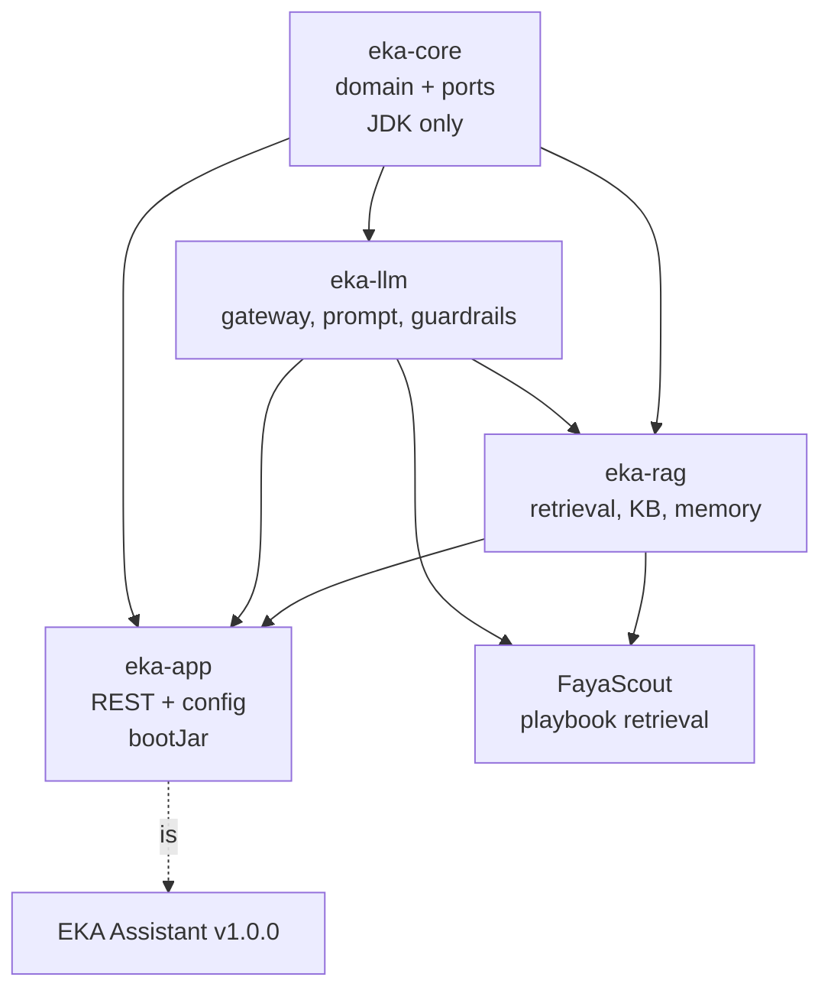

# EKA Platform Blueprint — Implementation Plan

**Date:** 2026-09-26 · **EKA:** v0.8.4, `main`, build green (813 tests) · **FayaScout:** 0.1.0-SNAPSHOT, live

This is an **implementation document**, not an analysis. The analysis already exists at
[`eka-fayascout-platform-analysis.md`](eka-fayascout-platform-analysis.md) and its findings are
taken as given rather than re-argued.

**What changed versus that analysis:** it was correct and too large to execute. It described a
platform of eight libraries and a two-way capability exchange — a quarter's work. This blueprint
targets **the smallest set of changes that makes EKA genuinely reusable**, sequenced so the first
real benefit lands in about an hour and the whole plan fits roughly two focused days.

**Total: 13 tasks, ~15 hours.** Every task is independently completable, independently revertable,
and leaves `main` green.

---

## 1. Executive Summary

One mechanical fact blocks everything: **EKA is a single Gradle module that produces only a
`bootJar`.** `settings.gradle` is one line. Nothing can depend on it, so "EKA is the platform"
is currently not true in the only sense that matters to a consumer.

The plan is deliberately anticlimactic:

1. **Make the existing module publishable as a library** (Task 1, ~45 min). No restructure, no file
   moves. Spring Boot already builds a `-plain.jar`; publishing it is configuration. **After this
   one task, FayaScout can depend on EKA.**
2. **Lock the boundaries with tests before moving anything** (Tasks 2–3).
3. **Split into four modules along the layer edges ArchUnit already enforces** (Tasks 4–7). These
   are *moves*, not redesigns — the package structure does not change, only which module each
   package lives in.
4. **Make FayaScout a real consumer** of retrieval over its own Markdown playbooks (Tasks 8–11) —
   the first genuine use of EKA by another product, and the thing that proves the platform is one.
5. **Accept one donation back** — FayaScout's `OllamaCallGate` into `eka-llm` (Tasks 12–13).

**What this blueprint deliberately does NOT do**, despite the analysis identifying all of it as real:
no durable-jobs module, no quota engine, no secrets primitive, no RBAC replacement, no connector
framework, no evaluation harness, no microservices, no namespace rename. Each is a genuine gap;
none blocks reuse today; every one of them is cheaper to build *after* a module structure exists
than as part of creating one. They are listed in §16 as explicitly deferred, not forgotten.

---

## 2. Vision

**Project EKA is two things in one repository, and naming them separately resolves most of the
confusion:**

- **The platform** — versioned Java libraries any product can depend on (`eka-core`, `eka-llm`, `eka-rag`).
- **The Assistant** — the self-hosted knowledge assistant heading for v1.0.0, which is the platform's
  *first* consumer (module `eka-app`), not the platform itself.

This resolves the tension the analysis raised (its §12) without splitting the repository, renaming
the namespace, or touching the frozen v1.0.0 roadmap: the v1.0.0 definition continues to describe
`eka-app`, and the libraries it sits on are the platform. One repository, one CI pipeline, one
version number, two identities made explicit by module boundaries.

Consumers, in the order they become real: **FayaScout** (now), **the Assistant** (v1.0.0), then
NASAB / Banking AI / internal assistants.

---

## 3. Current Architecture

```
project-eka/  (settings.gradle: rootProject.name = 'project-eka')
└── src/main/java/com/mudassirshahzad/eka/
    ├── domain/          77 files, ZERO non-JDK imports — verified
    ├── application/     use cases, orchestration
    ├── infrastructure/  adapters: Weaviate, Postgres, Ollama, Tika, JWT
    └── api/             REST controllers, DTOs, filters
```

| Property | State |
|---|---|
| Gradle modules | **1** |
| Artifacts | `bootJar` only (`-plain.jar` produced but unpublished) |
| Consumable as a library | **No** — the blocking fact |
| Layer enforcement | 8 ArchUnit rules, in CI on every PR |
| Tests | 813, 0 failures |
| Java / Boot / Gradle | 21 / 3.5.0 / 8.12 (no committed wrapper — CI provisions it) |

FayaScout, for contrast: also a single module (`rootProject.name = "fayascout"`, Kotlin DSL,
Boot 3.3.5), 566 main + 245 test files, no layer enforcement, ~93 `deploy-*.sh` scripts at the root.

**The layering is real and verified** — that is what makes the split in §10 a file move rather than
a refactor. The work is nearly all in build files.

---

## 4. Target Architecture

```
project-eka/
├── settings.gradle                 include 'eka-core','eka-llm','eka-rag','eka-app'
├── build.gradle                    shared config via subprojects { }
├── eka-core/     java-library  ✅ published   pure Java, zero Spring
├── eka-llm/      java-library  ✅ published   LLM gateway + prompt + guardrails
├── eka-rag/      java-library  ✅ published   retrieval, KB, documents, memory
└── eka-app/      bootJar       ❌ not published   REST + config = the Assistant
```

**Integration model: versioned libraries, not services.** Decided, with the reasoning kept short
because the analysis already made the case: FayaScout runs on a 4-core VPS whose single CPU-only
Ollama is already the bottleneck — a second JVM and a network hop cost RAM the box does not have
and buy nothing. Revisit when a second product ships *and* retrieval needs its own scaling profile.

**Publishing:** `mavenLocal()` for Tasks 1–3 (zero infrastructure, immediate), **GitHub Packages**
from Task 3 onward (free, already authenticated via `gh`, no new accounts).

---

## 5. Platform Modules

| Module | Owns | Depends on | Published | Seeded from |
|---|---|---|---|---|
| **`eka-core`** | Domain model, `TenantId`, ids, value objects, **all port interfaces**, domain errors | nothing (JDK only) | ✅ | EKA `domain/` |
| **`eka-llm`** | `LlmPort` + adapter, prompt building, injection fencing, output guardrails, citations; **later** the concurrency gate | `eka-core` | ✅ | EKA + FayaScout `ollama/` |
| **`eka-rag`** | Hybrid retrieval, RRF, re-ranking, HyDE, knowledge base, document parsing, conversation memory | `eka-core`, `eka-llm` | ✅ | EKA `application/` + `infrastructure/` |
| **`eka-app`** | REST controllers, DTOs, filters, Spring config, Flyway migrations, `main()` | all of the above | ❌ | EKA `api/` |

**Why four and not eight.** The analysis proposed eight (`eka-jobs`, `eka-security`,
`eka-integration`, `eka-eval`, `eka-observability` in addition). Four is what **existing consumers
actually need**: FayaScout has its own security, observability and job runtime already in
production. Creating empty modules for capabilities nobody consumes yet is the specific
over-engineering this blueprint is meant to avoid. Adding a fifth module later costs one
`settings.gradle` line — the structure makes that cheap, which is precisely why it does not need to
be done up front.

**Why `eka-llm` is separate from `eka-rag`.** This is the one split that earns its keep immediately:
FayaScout needs LLM access and structured prompting for outreach drafting, and does **not** need
Weaviate, embeddings or a knowledge base. Keeping them in one module would force every consumer of
prompting to drag in a vector store.

---

## 6. Library Boundaries

Rules, enforced by ArchUnit (Task 2) rather than by convention:

1. **`eka-core` has no Spring, JPA, Spring AI or Jackson imports.** Already true; now enforced at a
   module boundary. This is the single most valuable invariant in the build.
2. **All ports live in `eka-core`.** Adapters live in `eka-llm` / `eka-rag` / `eka-app`. A consumer
   depends on `eka-core` to *implement* a port without pulling any adapter.
3. **No module depends on `eka-app`.** It is a leaf.
4. **`eka-rag` may depend on `eka-llm`** (re-ranking and HyDE call a model). Not the reverse.
5. **Public API = anything not in an `internal` package.** Adding `internal` sub-packages is the
   cheapest available substitute for JPMS and does not require a module-info.

**One naming inconsistency to fix while moving** (analysis finding L1): ports are split between
`*Port` in `domain/*/port/` and bare `VectorStore`, `EmbeddingProvider`, `FileStorage`,
`DocumentParser`. At a published module boundary this becomes a documentation problem. Task 5
renames the four bare ones to `*Port` — a mechanical IDE rename, and the last moment it is free.

---

## 7. Package Structure

**The Java package namespace does not change.** `com.mudassirshahzad.eka.*` stays exactly as it is;
only module ownership changes. This is what keeps the split to file moves and makes every existing
import, test and ArchUnit rule continue to work.

```
eka-core/src/main/java/com/mudassirshahzad/eka/
    domain/{document,retrieval,chat,conversation,tenant,user,...}
    domain/*/port/          ← all port interfaces

eka-llm/src/main/java/com/mudassirshahzad/eka/
    llm/{prompt,guardrails,citation}
    infrastructure/llm/     ← Ollama adapter

eka-rag/src/main/java/com/mudassirshahzad/eka/
    application/{retrieval,ingestion,chat,conversation}
    infrastructure/{retrieval,vectorstore,embedding,parsing,storage}

eka-app/src/main/java/com/mudassirshahzad/eka/
    api/{controller,dto,filter,advice}
    config/
    EkaApplication.java
eka-app/src/main/resources/   application.yml, db/migration/**
```

**On the namespace question** (analysis finding M5): `com.mudassirshahzad.eka` is a personal
namespace for what is becoming shared infrastructure, and renaming is cheapest before a 1.0 API
commitment. **Recommendation: do not rename now.** It is a 376-file mechanical change with zero
functional benefit, it would collide with every task below, and the decision can be taken
independently at the v1.0.0 boundary. Recorded as a deliberate deferral, not an oversight.

---

## 8. Dependency Graph



Acyclic by construction: `core → llm → rag → app`. Gradle fails the build on a cycle, so this is
self-enforcing once the modules exist.

---

## 9. Migration Strategy

**Strangler, inside one process, one module at a time.** Four rules:

1. **Publishable before splittable.** Task 1 makes EKA consumable *without* restructuring, so the
   headline benefit is not held hostage to the riskiest work.
2. **Tests before moves.** Task 2 adds the boundary rules that will catch a bad move, before any
   move happens.
3. **One module per commit.** Each of Tasks 4–7 is a complete, green, revertable commit.
4. **Extract by moving, never by rewriting.** `git mv` preserves history and keeps the diff
   reviewable. Any behavioural change discovered mid-move becomes its own follow-up task.

**FayaScout is not touched until Task 8**, and when it is, it is additive — a new capability over
its existing Markdown playbooks. No FayaScout code is deleted, moved or refactored anywhere in this
plan. Its 22 `@Scheduled` methods and five worker runtimes keep running untouched.

**Version and CI:** the root `version` stays the single source of truth (ADR EX03) and all modules
inherit it, so `build-info.properties`, tags and releases keep agreeing. `gradle clean build` at the
root continues to build and test everything, so `.github/workflows/build.yml` needs **no change**
until Task 3 adds publishing.

---

## 10. Extraction Order

Ordered by *risk-adjusted value*, not by dependency convenience:

| # | Task | Why here |
|---|---|---|
| 1 | Publish the current module as a library | Unblocks everything, risks nothing |
| 2–3 | Boundary tests + consumer smoke test | Safety net **before** any move |
| 4 | `eka-core` | Zero non-JDK imports = zero-risk move, highest-value boundary |
| 5 | Port naming + `eka-llm` | Last free moment for the rename |
| 6 | `eka-rag` | Largest move; both dependencies already stable |
| 7 | `eka-app` | Whatever remains; proves the split by still booting |
| 8–11 | FayaScout consumes retrieval | The point of the whole exercise |
| 12–13 | `OllamaCallGate` → `eka-llm` | Donation back; needs `eka-llm` to exist first |

---

## 11. Risks

| Risk | L | Impact | Mitigation |
|---|---|---|---|
| Flyway migrations land in the wrong module and the app stops migrating | Med | High | Migrations stay in `eka-app/src/main/resources/db/migration` — libraries never own schema. Verified by a Testcontainers boot in Task 7 |
| Spring component scanning misses relocated `@Component`s | Med | High | Package names unchanged, so `@SpringBootApplication` scanning is unaffected. Task 7's context-load test is the gate |
| Test sources split incorrectly; coverage silently drops | Med | High | Assert the total **before and after each task**: 813 now. A task that lowers it is reverted, not debugged |
| A published library leaks a Spring dependency into `eka-core` | Low | Med | ArchUnit rule from Task 2, in CI |
| Boot version skew EKA 3.5.0 / FayaScout 3.3.5 breaks consumption | **High** | Med | Real and unavoidable. `eka-core` is JDK-only so it is immune; `eka-rag`/`eka-llm` are not. Task 9 aligns FayaScout to Boot 3.5.16 **as its own task, before** any library dependency is added. See [`dependency-roadmap.md`](dependency-roadmap.md) |
| 104 open advisories inherited by every consumer | **High** | **High** | **Do the §2 security work in `dependency-roadmap.md` before publishing anything reusable.** Publishing a library with 8 criticals propagates them to every future product |
| Scope creep back toward the eight-module design | Med | Med | §16 defers them by name. Adding a module is one `settings.gradle` line, so there is no cost to waiting |

**The two High/High risks are both dependency risks, not architecture risks.** That is the real
sequencing constraint in this document: the security upgrade should precede first publication.

---

## 12. Success Criteria

1. FayaScout's `build.gradle.kts` declares a dependency on an EKA artifact and compiles.
2. FayaScout answers a question over its own Markdown playbooks using EKA retrieval — a capability
   it did not have.
3. `eka-core` publishes with **zero** Spring/JPA/Spring AI/Jackson on its compile classpath.
4. EKA's test total is **≥ 813** at every commit.
5. `eka-app` boots and serves the same REST surface as v0.8.4 — no consumer-visible change.
6. Adding a fifth module requires one `settings.gradle` line and no restructuring.
7. CI stays green throughout; no task leaves `main` red.

---

## 13. Acceptance Criteria

Per task, all four must hold before the commit:

- [ ] `gradle clean build` green at the repository root.
- [ ] Test count ≥ the count before the task (record it in the commit message).
- [ ] ArchUnit green, **including** any rule the task adds.
- [ ] Documentation updated in the same commit — `CHANGELOG.md`, and `.claude/PROJECT_STATE.md`
      when module structure changes.

Blueprint-complete when all 13 are done, §12 holds, and `docs/architecture/` describes four modules.

---

## 14. Testing Strategy

**No new test framework, no new test style.** Tests move with the code they test.

| Level | Where | Asserts |
|---|---|---|
| Unit | each module | unchanged behaviour; moved verbatim |
| Architecture | `eka-core` + root | layer edges, module boundaries, `eka-core` purity |
| Integration | `eka-rag`, `eka-app` | Testcontainers Postgres; existing suites relocated |
| Boot | `eka-app` | context loads, Flyway migrates, REST surface intact |
| Consumer | FayaScout | its own suite stays green after adding the dependency |

**The load-bearing assertion is the test count.** 813 → any lower number after a move means tests
were silently orphaned by a source-set path, which is the most likely failure mode of this entire
plan and is invisible unless counted. Count it every task.

New tests are added only where genuinely new behaviour appears: Task 2 (boundary rules), Task 3
(consumer smoke test), Task 11 (playbook retrieval), Task 13 (the call gate).

---

## 15. Rollback Strategy

Every task is one commit, so `git revert <sha>` is the primary mechanism. Specifically:

- **Tasks 1–3** — build-file-only. Revert is trivially safe.
- **Tasks 4–7** — `git mv` moves. Revert restores the previous module layout exactly; history is
  preserved because nothing was rewritten.
- **Tasks 8–11** — FayaScout, additive only. Revert removes a capability; nothing existing regresses.
- **Tasks 12–13** — the gate moves but FayaScout keeps its own copy until Task 13 passes, so there is
  never a window where FayaScout has no gate.

**Published artifacts are the one thing revert cannot undo** — a published version is immutable.
Mitigation: publish `0.9.0-SNAPSHOT` throughout this work and cut the first release version only
after Task 13 and the security upgrade. Never yank a published release; supersede it.

**Abort condition:** if Tasks 4–7 exceed their estimates by more than ~2×, stop and keep Tasks 1–3.
That combination — a publishable single-module library — already delivers the headline outcome and
is a legitimate, stable resting point, not a failure.

---

## 16. Implementation Checklist

> ### Status — 2026-09-26
>
> | Task | Status |
> |---|---|
> | 0 — Security upgrade | ✅ **Done** — 96/104 advisories closed (ADR DEP01/DEP02) |
> | 1 — Make EKA consumable as a library | ✅ **Done** (ADR PL01) |
> | 2 — Enforce the future module boundaries now | ✅ **Done** — 11 ArchUnit rules (ADR PL04) |
> | 3 — Publish to GitHub Packages and prove consumption | ✅ **Done** (ADR PL03) — with one deviation, below |
> | 4–7 — Module extraction (`eka-core`/`eka-llm`/`eka-rag`/`eka-app`) | ⬜ **Not started** |
> | 8–13 — FayaScout consumption, `OllamaCallGate` donation | ⬜ **Not started** |
>
> **Deviations from Task 1/3 as written, and why:**
>
> - **Task 3 said set `version = '0.9.0-SNAPSHOT'` for the duration.** Not done. `v0.9.0` is
>   reserved by the frozen roadmap (ADR GOV03) for *Phase 8 complete*, and Phase 7 is still open on
>   ADR RQ07 — claiming that number here would silently reorder the roadmap. Publishing is instead
>   gated to release tags, so no version change was needed.
> - **Task 3's scratch consumer became a permanent, CI-run project** (`platform-smoke/`, ADR PL03).
>   It stopped being throwaway the moment it caught a real defect: Gradle Module Metadata published
>   versionless dependencies and would have broken every Gradle consumer while every check in this
>   repository stayed green (ADR PL02).
> - **Task 1 did not anticipate a code change.** Spring AI 1.1 renamed `OllamaOptions` to
>   `OllamaChatOptions`; two lines in `OllamaLlmAdapter`.
>
> **Tasks 4–7 are deliberately not started in the same session as 0–3.** The blueprint's own
> migration rules require one module per commit, each complete and green, with the boundary tests
> (Task 2) landed first as the safety net — which they now are. Everything Task 4 needs is in place.


Sequential. Each task: objective → files → steps → validation → rollback → duration.
Run `gradle clean build` at the root and record the test count in every commit message.

> Gradle invocation, for reference (no committed wrapper — deliberate, CI provisions 8.12):
> `~/.gradle/wrapper/dists/gradle-8.12-bin/*/gradle-8.12/bin/gradle`

---

### Task 0 — Security upgrade (prerequisite)

**Objective.** Close the 8 critical / 40 high advisories before publishing anything other products
will depend on.
**Files.** `build.gradle`.
**Steps.** Execute §4 "Safe to upgrade now" of [`dependency-roadmap.md`](dependency-roadmap.md):
Boot 3.5.0 → 3.5.16; `ext['tomcat.version'] = '10.1.60'`; Spring AI 1.0.0 → 1.0.9; ArchUnit 1.5.1;
pin `commons-lang3` 3.18.0, `spring-retry` 2.0.13, `log4j-api` 2.25.5.
**Validation.** `gradle clean build` green, 813 tests. `gh api .../dependabot/alerts --paginate`
shows 0 critical.
**Rollback.** Revert the commit; it touches one file.
**Duration.** 60 min (mostly CI).
**Why Task 0.** Publishing a library propagates its advisories to every consumer. This is the one
item that genuinely must precede the rest.

---

### Task 1 — Make EKA consumable as a library

**Objective.** Publish the existing module as a versioned library. **No restructuring.**
**Files.** `build.gradle`.
**Steps.**
1. Add `id 'maven-publish'` to `plugins`.
2. Add `java { withSourcesJar() }`.
3. Configure publishing of the **plain** jar:
   ```groovy
   tasks.named('jar') { archiveClassifier = '' }        // plain jar is the library
   tasks.named('bootJar') { archiveClassifier = 'boot' } // app jar keeps a classifier
   publishing {
       publications { library(MavenPublication) { from components.java } }
       repositories { mavenLocal() }
   }
   ```
4. `gradle publishToMavenLocal`.
**Validation.** `ls ~/.m2/repository/com/mudassirshahzad/project-eka/0.8.4/` shows the jar, sources
jar and POM. `gradle clean build` still green, 813 tests. Confirm `build/libs/` still contains a
runnable boot jar.
**Rollback.** `git revert`; delete the local `~/.m2` directory.
**Duration.** 45 min.
**Trap to watch.** The Dockerfile does `COPY --from=build /workspace/build/libs/*.jar app.jar`.
That glob is safe **today** only because the build stage runs `gradle clean bootJar`, which does not
run the `jar` task — so exactly one jar exists. Step 3 renames the boot jar to `*-boot.jar`, and any
future change that also produces the plain jar makes the glob match two files and fail. Pin the
`COPY` to the exact boot-jar name in this same commit rather than leaving the glob.

---

### Task 2 — Enforce the future module boundaries now

**Objective.** Add the boundary rules *before* any code moves, so a bad move fails CI.
**Files.** `src/test/java/com/mudassirshahzad/eka/architecture/HexagonalArchitectureTest.java`.
**Steps.** Add three ArchUnit rules to the existing 8:
1. `domain` must not depend on Spring, JPA, Spring AI or Jackson (the `eka-core` purity invariant).
2. `api` must not depend on `infrastructure` (analysis finding L2 — currently true, unenforced).
3. Classes named `*Adapter` must implement an interface from `domain`.
**Validation.** `gradle test --tests '*HexagonalArchitectureTest'` — 11 rules green. Then
deliberately add a Spring import to a `domain` class, confirm rule 1 fails, and revert.
**Rollback.** `git revert`.
**Duration.** 60 min.
**Why before the split.** These rules are the safety net for Tasks 4–7. Added afterwards, they
would only confirm whatever the moves happened to produce.

---

### Task 3 — Publish to GitHub Packages and prove consumption

**Objective.** Prove an external project can actually resolve and use the artifact.
**Files.** `build.gradle`, `.github/workflows/build.yml`, throwaway scratch project.
**Steps.**
1. Add a GitHub Packages repository to `publishing.repositories`, credentials from
   `GITHUB_ACTOR` / `GITHUB_TOKEN` env vars.
2. Set root `version = '0.9.0-SNAPSHOT'` for the duration of this work (per §15).
3. Add a `publish` job to CI, `if: github.event_name == 'push'`, `needs: build`.
4. In a scratch directory outside both repositories, create a minimal Gradle project that depends
   on the artifact and instantiates one domain class.
**Validation.** Scratch project compiles and runs. CI publish job green on push to `main`.
**Rollback.** `git revert`. Published SNAPSHOTs are overwritable, so no permanent artifact is left.
**Duration.** 90 min.

---

### Task 4 — Extract `eka-core`

**Objective.** Move `domain/` into its own JDK-only published module.
**Files.** `settings.gradle`, `build.gradle`, new `eka-core/build.gradle`, all of `domain/` + its tests.
**Steps.**
1. `settings.gradle`: `include 'eka-core'`.
2. Move shared config in the root `build.gradle` into `subprojects { }`; keep `version` at the root.
3. `eka-core/build.gradle`: `plugins { id 'java-library'; id 'maven-publish' }`. **Declare no
   dependencies except test ones** — that is the whole point of this module.
4. `git mv src/main/java/com/mudassirshahzad/eka/domain eka-core/src/main/java/com/mudassirshahzad/eka/domain`
   and the matching test tree.
5. Move `HexagonalArchitectureTest` to `eka-core` (or keep at root scanning all modules — either
   works; pick one and note it in the commit).
6. Root module: `implementation project(':eka-core')`.
**Validation.** `gradle clean build` green. **Test count ≥ 813.**
`gradle :eka-core:dependencies --configuration compileClasspath` shows **no** Spring/JPA/Spring AI.
**Rollback.** `git revert` — a pure move, so revert is exact.
**Duration.** 120 min.

---

### Task 5 — Rename the four bare ports, then extract `eka-llm`

**Objective.** Make port naming consistent (§6) while it is still free, then split out the LLM module.
**Files.** `VectorStore`, `EmbeddingProvider`, `FileStorage`, `DocumentParser` + call sites; new
`eka-llm/`; `llm/`, prompt, guardrails, citation packages and the Ollama adapter.
**Steps.**
1. Rename the four interfaces to `VectorStorePort`, `EmbeddingProviderPort`, `FileStoragePort`,
   `DocumentParserPort` (mechanical rename; commit this **separately** from the move).
2. `include 'eka-llm'`; `eka-llm/build.gradle` depends on `project(':eka-core')` + Spring AI.
3. `git mv` the prompt-building, guardrails, citation and Ollama-adapter packages into `eka-llm`.
**Validation.** `gradle clean build` green, test count ≥ 813. `gradle :eka-llm:dependencies` shows
`eka-core` and **not** Weaviate.
**Rollback.** Two commits, revert either independently.
**Duration.** 120 min.
**Note.** Two logical changes, so **two commits** — the rename touches many files shallowly, the
move touches few files deeply. Mixing them makes the diff unreviewable.

---

### Task 6 — Extract `eka-rag`

**Objective.** Move retrieval, knowledge base, document processing and conversation memory.
**Files.** new `eka-rag/`; `application/`, `infrastructure/{retrieval,vectorstore,embedding,parsing,storage}`.
**Steps.**
1. `include 'eka-rag'`; depends on `eka-core` + `eka-llm` (re-ranking and HyDE call a model).
2. `git mv` the packages and their tests, Testcontainers integration tests included.
3. **Flyway migrations stay in `eka-app`** — libraries do not own schema (§11).
**Validation.** `gradle clean build` green, test count ≥ 813. Retrieval integration tests still run
against Testcontainers Postgres.
**Rollback.** `git revert`.
**Duration.** 120 min.
**Largest task.** If it overruns, split by sub-package (`retrieval` first, then `ingestion`) rather
than pushing through — each half is independently green.

---

### Task 7 — Reduce the root to `eka-app`

**Objective.** Leave the REST surface and Spring configuration as the non-published application.
**Files.** `settings.gradle`, root `build.gradle`, new `eka-app/`, `api/`, `config/`, resources.
**Steps.**
1. `include 'eka-app'`; move `api/`, `config/`, `EkaApplication.java` and **all** of
   `src/main/resources` (`application.yml`, `db/migration/**`).
2. `eka-app/build.gradle` keeps the `org.springframework.boot` plugin, `bootJar` and
   `springBoot { buildInfo() }`; depends on all three libraries.
3. Root `build.gradle` becomes shared config only — no `src/`.
4. Update the `Dockerfile` build stage to `gradle :eka-app:bootJar` and fix the `COPY` path to
   `eka-app/build/libs/`.
**Validation.** `gradle clean build` green, test count ≥ 813. Boot context loads, Flyway migrates,
REST surface unchanged. `docker build .` succeeds and the image still runs non-root
(`docker run --rm --entrypoint id  -u` ≠ 0).
**Rollback.** `git revert`.
**Duration.** 120 min.
**This task proves the split.** If the app boots and migrates, the four-module structure is correct.

---

### Task 8 — Decide and document the FayaScout integration point

**Objective.** Pick the single narrowest first use case, in writing, before touching FayaScout.
**Files.** `docs/analysis/fayascout-integration.md` (new, short).
**Steps.** Record: which playbooks under FayaScout's `docs/knowledge/junaid-playbooks/` are
in scope; which EKA modules FayaScout will depend on (`eka-core` + `eka-rag`, **not** `eka-app`);
whether tenancy is used or passed a fixed single-tenant `TenantId`; where embeddings will live
(reuse FayaScout's Postgres, or stand up Weaviate on the VPS — **decide this explicitly**, it has
real memory cost on a 4-core box).
**Validation.** Document answers all four questions unambiguously.
**Rollback.** Delete the file.
**Duration.** 45 min.
**Why a task.** These four are exactly the decisions that, left implicit, turn Tasks 9–11 into
architectural debate. Deciding them costs 45 minutes; discovering them mid-implementation costs a day.

---

### Task 9 — Align FayaScout's Spring Boot version

**Objective.** Remove the version-skew risk (§11) **before** adding a library dependency.
**Files.** FayaScout `build.gradle.kts`.
**Steps.** Boot 3.3.5 → 3.5.16, `io.spring.dependency-management` 1.1.6 → 1.1.7. Both repositories
then sit on one Boot line.
**Validation.** FayaScout's full suite green (245 test files — expect real work here; it is a
two-minor jump on a live application).
**Rollback.** `git revert` in FayaScout. Nothing in EKA depends on this having happened.
**Duration.** 120 min.
**Do not skip.** Consuming `eka-rag` across a two-minor Boot gap produces classpath errors that look
like EKA bugs and are not.

---

### Task 10 — FayaScout depends on EKA

**Objective.** The dependency edge itself, and nothing else.
**Files.** FayaScout `build.gradle.kts`, `settings.gradle.kts`.
**Steps.** Add the GitHub Packages repository with credentials; declare
`implementation("com.mudassirshahzad:eka-core:0.9.0-SNAPSHOT")` and `eka-rag`. Add **no** business code.
**Validation.** FayaScout compiles; full suite green; application still boots. One EKA domain class
is importable from a FayaScout test.
**Rollback.** `git revert` — removes two lines.
**Duration.** 60 min.
**This task is §12 criterion 1.** Keeping it separate from Task 11 means a dependency-resolution
problem and a retrieval-behaviour problem can never be confused for each other.

---

### Task 11 — Playbook retrieval in FayaScout

**Objective.** Answer a question over the Markdown playbooks. The first real platform consumption.
**Files.** new `src/main/java/com/fayahub/fayascout/playbook/` (~3 classes), one test.
**Steps.**
1. An ingestion component that walks the playbook directory and feeds each file through EKA's
   document parsing + chunking + embedding.
2. A query component calling EKA retrieval with the fixed `TenantId` from Task 8.
3. One integration test: ingest a small fixture, ask a question whose answer is only in it, assert
   the answer cites the right file.
**Validation.** That test passes. FayaScout's existing suite unaffected.
**Rollback.** `git revert` — a new package plus one test; nothing existing is modified.
**Duration.** 120 min.
**This is §12 criterion 2 — the point of the entire blueprint.** Stop here if time runs out; Tasks
12–13 are an optimisation by comparison.

---

### Task 12 — Add a concurrency-gate port to `eka-llm`

**Objective.** Give the platform the seam FayaScout's gate will slot into, without moving it yet.
**Files.** `eka-core` (new port), `eka-llm` (default implementation).
**Steps.**
1. In `eka-core`, a small port: acquire/release with a priority enum (`PRODUCTION`, `BACKGROUND`).
2. In `eka-llm`, a default no-op/unbounded implementation so **existing EKA behaviour is unchanged**.
3. Route EKA's Ollama adapter through the port.
**Validation.** `gradle clean build` green, test count ≥ 813. EKA behaviour identical — the default
implementation gates nothing.
**Rollback.** `git revert`.
**Duration.** 90 min.

---

### Task 13 — Move `OllamaCallGate` into `eka-llm`

**Objective.** The donation back: one process-wide, priority-aware gate, owned by the platform.
**Files.** FayaScout `ollama/OllamaCallGate.java` (~11 KB) → `eka-llm`; FayaScout call sites.
**Steps.**
1. Port `OllamaCallGate` into `eka-llm` as the real implementation of the Task 12 port, with its
   tests. Keep its priority semantics and its documented non-starvation behaviour intact.
2. Repoint FayaScout's call sites at the platform bean.
3. **Delete FayaScout's copy only once its suite is green** with the platform implementation.
**Validation.** EKA build green, test count ≥ 813 plus the gate's own tests. FayaScout's suite
green. Concurrent-inference behaviour on the VPS unchanged — this gate exists because five
independent `Semaphore(1)` instances once wedged the box; verify it still serialises.
**Rollback.** `git revert` in FayaScout restores its own gate; the platform copy is inert without
call sites, so there is never a window with no gate.
**Duration.** 120 min.

---

## Summary

| Group | Tasks | Time | Delivers |
|---|---|---|---|
| Prerequisite | 0 | 1 h | 0 critical advisories |
| **Consumable** | 1–3 | 3.25 h | **EKA is a usable library** |
| Module split | 4–7 | 8 h | Four published modules |
| **First consumer** | 8–11 | 5.75 h | **FayaScout retrieves over its playbooks** |
| Donation back | 12–13 | 3.5 h | Platform-owned LLM gate |
| | **14** | **~21 h** | |

Two resting points where stopping is legitimate rather than incomplete: **after Task 3** (EKA
consumable, nothing restructured) and **after Task 11** (platform proven by a real second consumer).

**Deliberately deferred, by name, with no milestone attached:** durable jobs runtime, external-API
quota engine, secrets/credential primitive, RBAC replacement, connector framework, evaluation
harness, structured-output contracts, resource governor, operator control plane, namespace rename,
microservice extraction. Every one is a real gap the analysis documented. None blocks reuse, and
each is cheaper once four modules exist than as part of building them.
